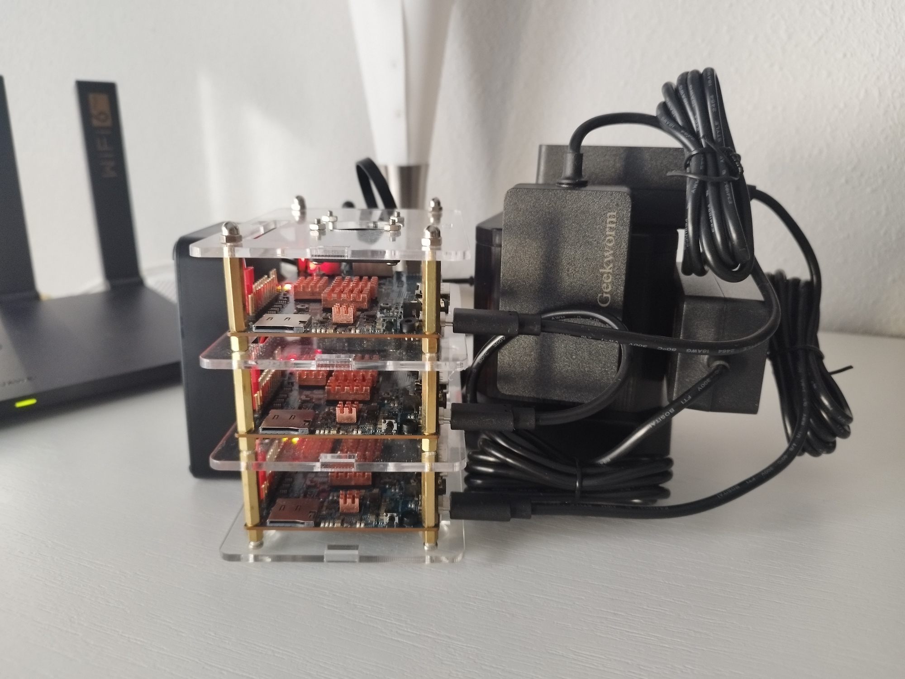
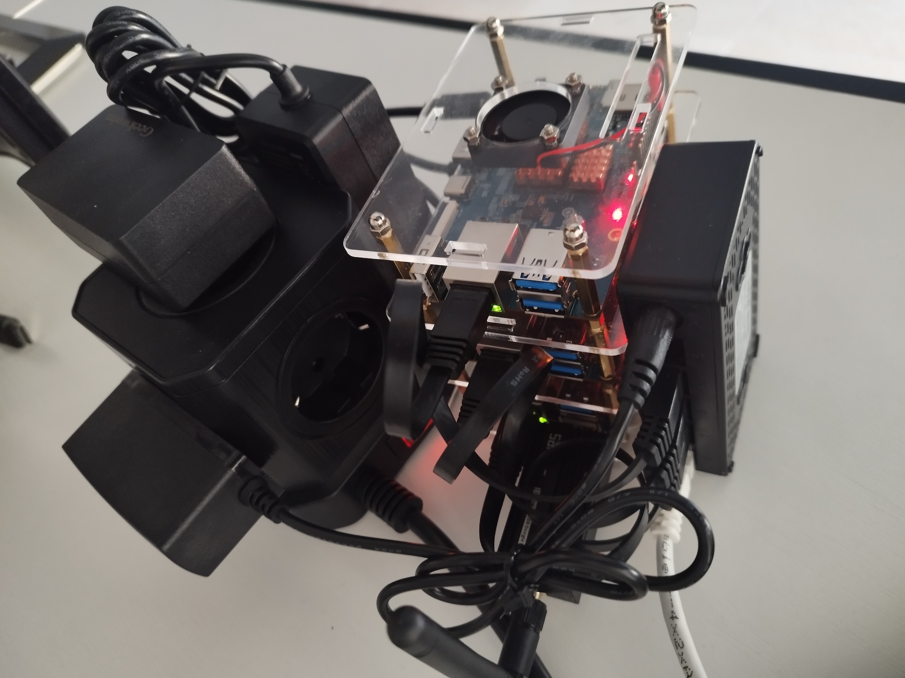
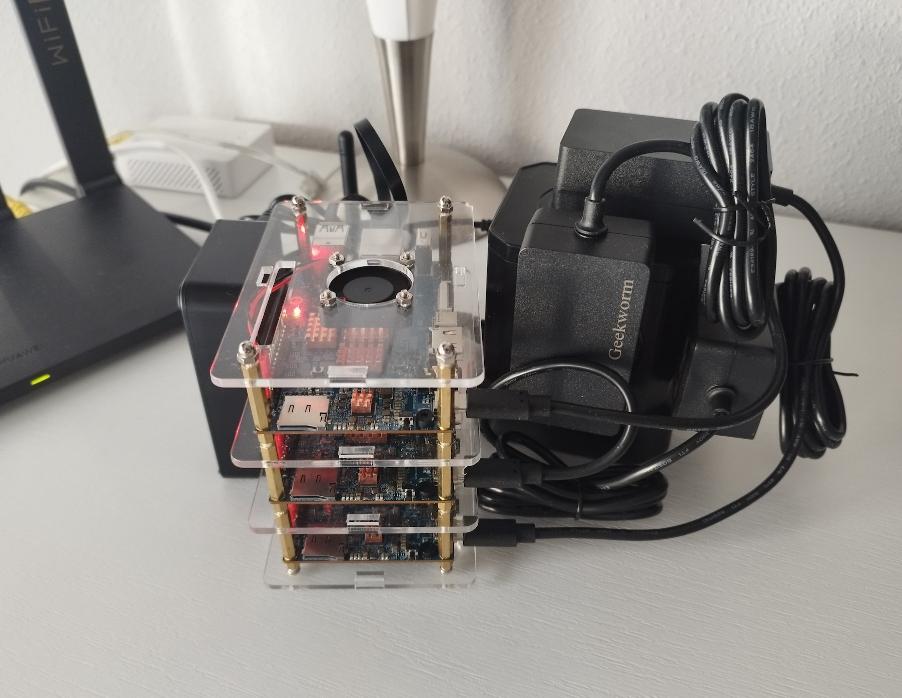
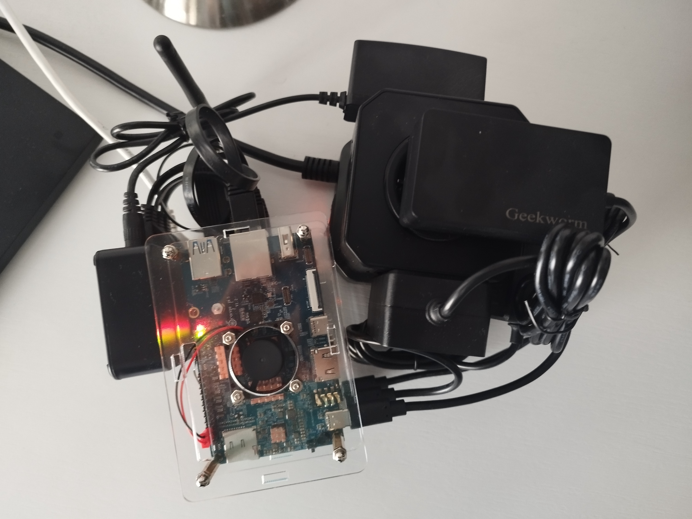
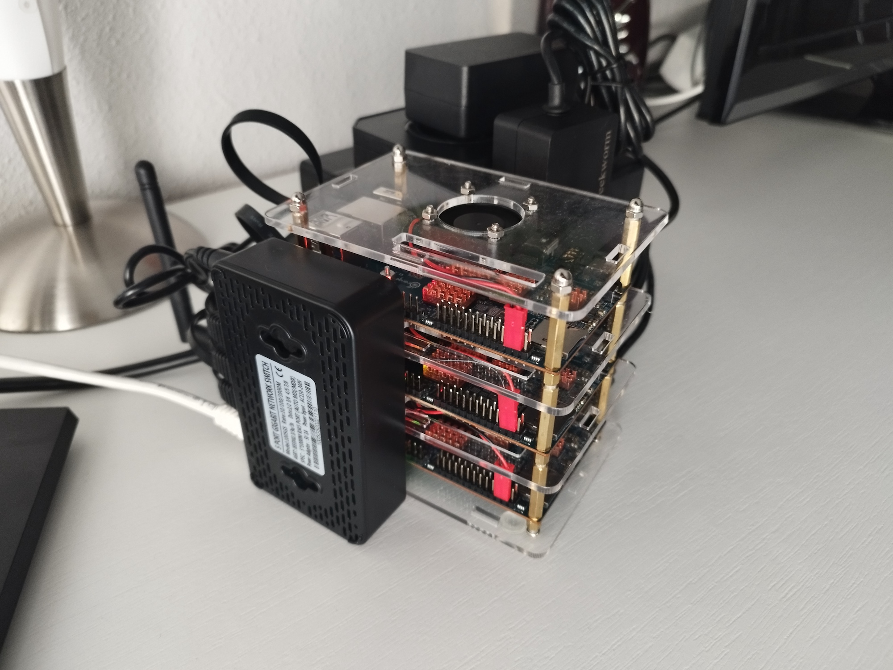
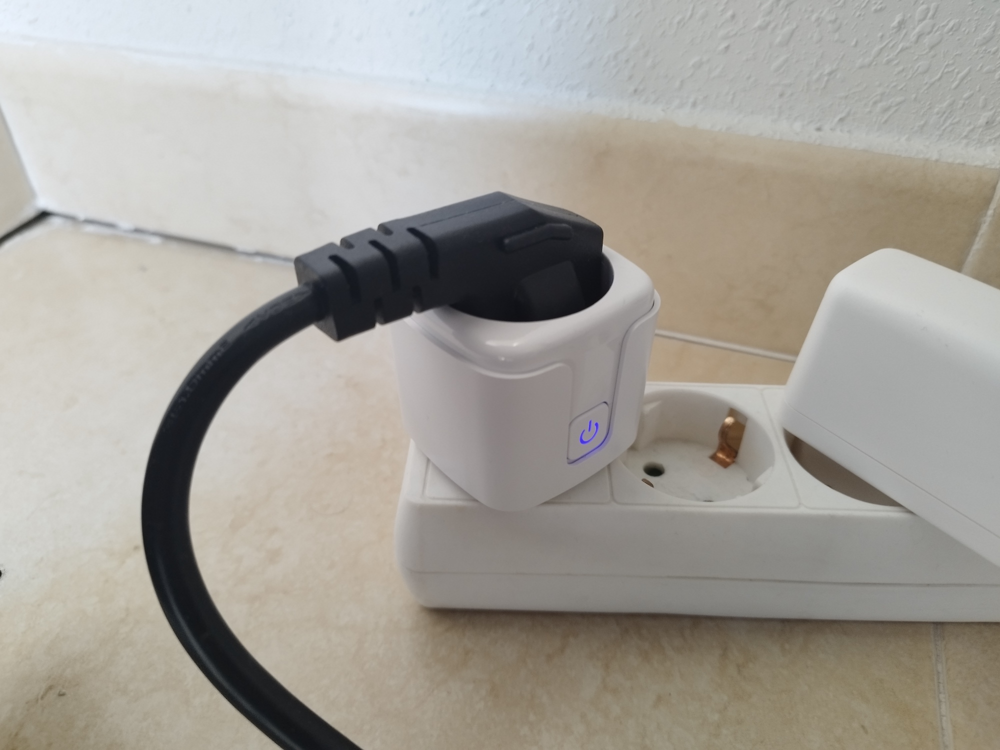

# Welcome to Homelab

Create a Homelab from Scratch using latest best practices, patterns and tools.

## Cluster

=== "Front"

    

    { vertical-align=top horizontal-align=center width=800 }

    Top View

    

=== "Back"

    

    { vertical-align=top horizontal-align=center width=800 }

    Back View

    

=== "Up"

    

    { vertical-align=top horizontal-align=center width=800 }

    Back View

    

=== "Top"

    

    { vertical-align=top horizontal-align=center width=800 }

    Back View

    

=== "Left"

    

    { vertical-align=top horizontal-align=center width=800 }

    Back View

    

## Devices

=== "SONOFF Zigbee 3.0 USB Dongle Plus V2"

    

    { vertical-align=top horizontal-align=center width=800 }

    Top View

    

