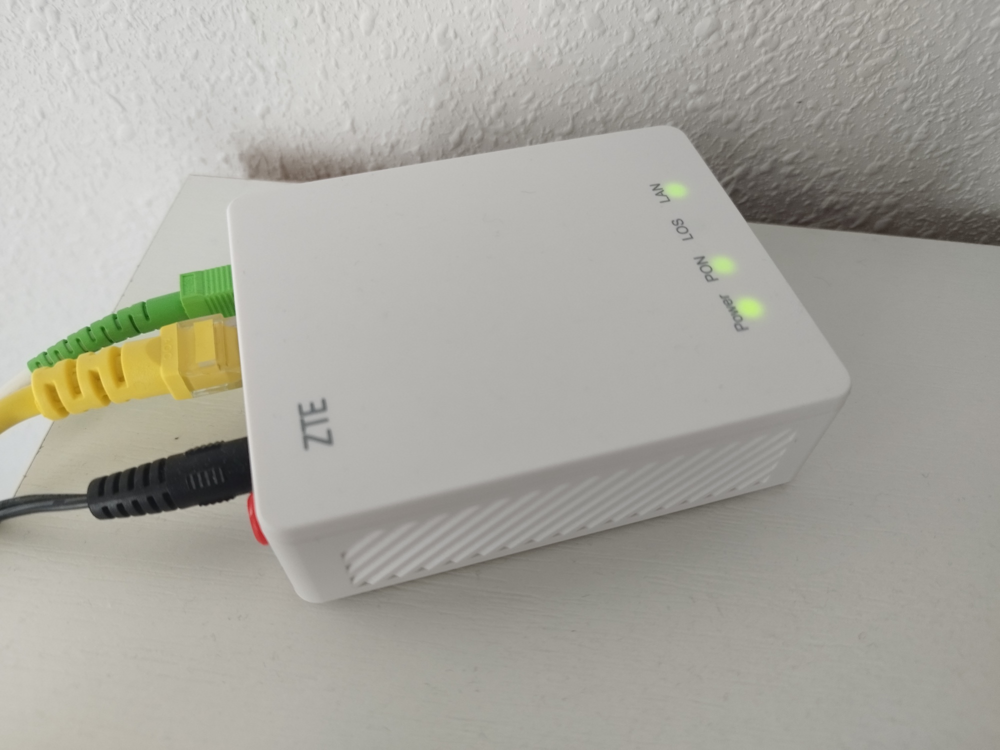
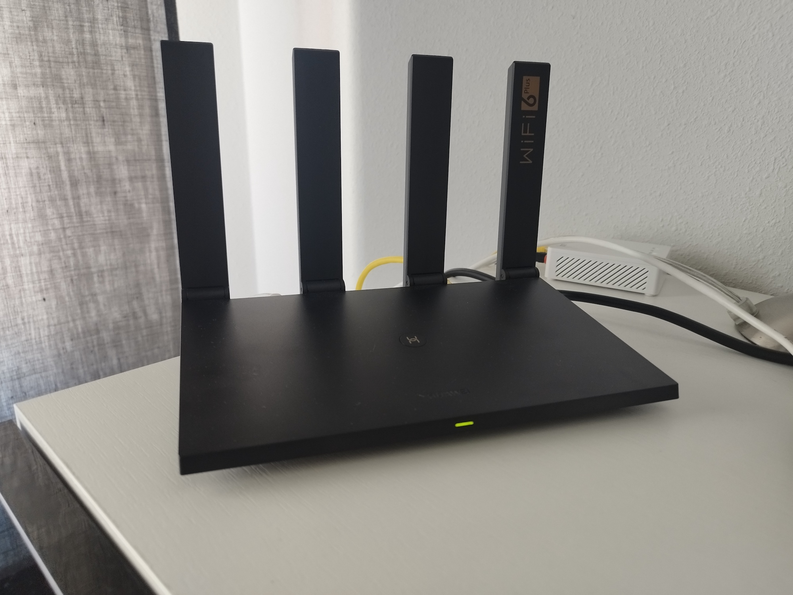

# Homelab

## What is a Homelab?

**Homelab** is the name given for a server-based setup that resides **locally** in your home that can host several **applications** or **virtualized systems**. A homelab can be used for many purposes such as *learning*, *developing*, *testing*, *media server*, *backup* etc..

Server can go go from simple tower, mini-PC or Single Board Computers (SBC), such as Raspberry Pi or OrangePi, to more powerful devices or repurposed rack servers that you can acquire from companies who discard them due to their age but are still usable.

## Usages

Depending on your needs or goals a Homelab can have different usages:

* It provides you a **playground** for **learning** and **breaking** things.
* It lets you work and **experiment** with projects that you cannot try on the job itself.
* It allow you to perform **backup** to you personal data or storing **secrets** and **passwords**, so you do not rely on SaaS or external providers.
* If you want host **media** like movies, photos, music and eBooks.
* If you want to allow **home automation** that puts local control and privacy first.

## My Homelab

My Homelab is bases on **Single Board Computers (SBC)** based on **ARM Architecture family** so the energy consumption is **low** and **cheap**. The SBC chosen are **OrangePI 5** that are very powerful boards and similar to Raspberry Pi 5 models, but with *less support* from the community.

{ align=center width=800 }

## Costs

Building a homelab can be cheap or expensive depending on the **number of servers**, **components**, **maintenance costs** or **energy consumption**.
From the component perspective my homelab setup are broken into the following items:

| Component | Units | Cost/Unit | Link |
| --- | --- | --- | --- |
| Orange Pi 5 8GB RAM Single Board Computer RK3588S PCIE Module External Wifi6.0+BT5.0 SSD | 3 | 91,39€ | [AliExpress](https://es.aliexpress.com/item/1005004942239582.html?spm=a2g0o.order_list.order_list_main.40.2b7e194dUJjTJB&gatewayAdapt=glo2esp) |
| Orange Pi 5 Acrylic Case Transparent Enclosure Clear Shell Optional Cooling Fan Copper Aluminum Heat Sinks | 3 | 5,39€ | [AliExpress](https://www.aliexpress.com/item/1005005057630718.html?spm=a2g0o.order_list.order_list_main.5.2b7e1802BHdhcR) |
| Gigabit Network Switch Mini Desktop 5Ports Switch Ethernet 1000Mbps Hi | 1 | 16,17€ | AliExpress |
| 6pack Ethernet Network Cable RJ45 | 1 | 6,32€ | [AliExpress](https://www.aliexpress.com/item/1005003995751089.html?spm=a2g0o.store_pc_home.promoteWysiwyg_2001899042546.1005003995751089) |
| Transcend MTE300S 512GB NVMe PCIe Gen3 x4 M.2 2230 Internal Solid State Drive (SSD) | 3 | 50,47€ | [Amazon](https://www.amazon.es/dp/B0BTDRKBBL?psc=1&ref=ppx_yo2ov_dt_b_product_details) |
| SanDisk Extreme 64 GB MicroSDXC UHS-I Class 10 | 2 | 11,99€ | [Amazon](https://www.amazon.es/dp/B09X7C7LL1?psc=1&ref=ppx_yo2ov_dt_b_product_details) |
| Poppstar Juego de Tornillos de Ordenador (para M.2 SSD/NVMe montaje para placa base de ASUS y ASROCK) | 1 | 6,59€ | [Amazon](https://www.amazon.es/dp/B087C1G4ZF?ref=ppx_yo2ov_dt_b_product_details&th=1) |
| VOOMY Cube Regleta Enchufe, 9-en-1 Alargador Enchufe Cubo, Regleta Enchufes con 5 Tomas y 4 USB Puertos | 1 | 27,95€ | [Amazon](https://www.amazon.es/dp/B0B2X4JXBW?psc=1&ref=ppx_yo2ov_dt_b_product_details) |
| Geekworm Raspberry Pi 4 Alimentador Power Supply, USB-C 5V 4A 20W Power Adapter | 3 | 13,89€ | [Amazon](https://www.amazon.es/dp/B09J4V3RYK?psc=1&ref=ppx_yo2ov_dt_b_product_details) |
| Zigbee 3.0 USB Dongle Plus,SONOFF Zigbee Gateway, Zigbee USB Hub | 1 | 26,69€ | [Amazon](https://www.amazon.es/dp/B0B6P22YJC?psc=1&ref=ppx_yo2ov_dt_b_product_details) |
| ZigBee Enchufe Inteligente Alexa 16A, 3680W Smart Plug con Monitor de Energía | 1 | 15,29€ | [Amazon](https://www.amazon.es/dp/B0BFV52WHM?psc=1&ref=ppx_yo2ov_dt_b_product_details) |
| | **TOTAL** | **606,41€** | |

## Cluster

=== "Front"

    

    { align=center width=800 }

    Top View

    

=== "Left"

    

    { vertical-align=top horizontal-align=center width=800 }

    Back View

    

=== "Top"

    

    { vertical-align=top horizontal-align=center width=800 }

    Back View

    

=== "Back"

    

    { vertical-align=top horizontal-align=center width=800 }

    Back View

    

## Devices

=== "ONT Network Router 1GE"

    

    { vertical-align=top horizontal-align=center width=800 }

    Top View

    

=== "HUAWEI WiFi AX3 Pro"

    

    { vertical-align=top horizontal-align=center width=800 }

    Top View

    

=== "SONOFF Zigbee 3.0 USB Dongle Plus V2"

    

    { vertical-align=top horizontal-align=center width=800 }

    Top View

    

