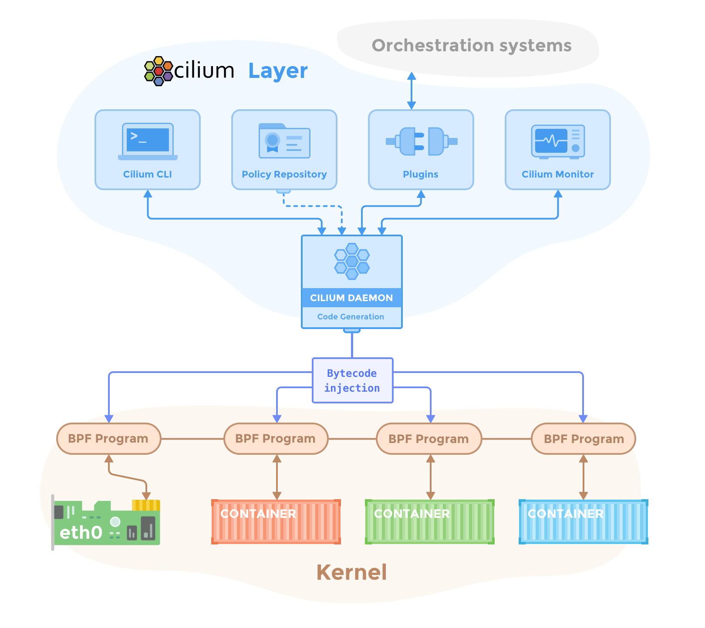
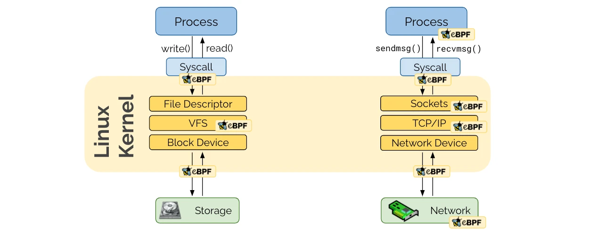
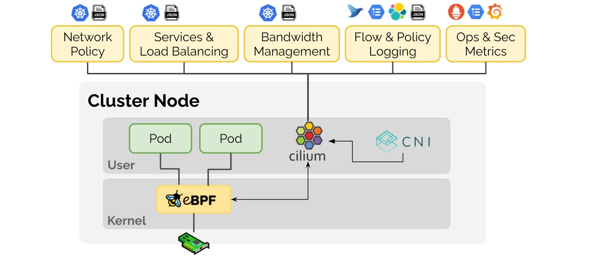
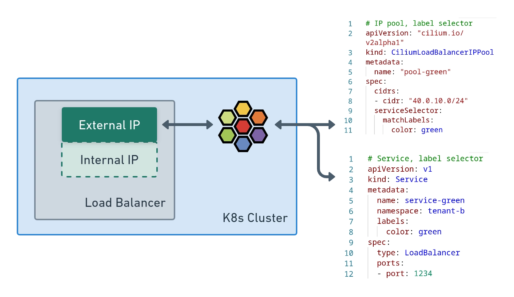
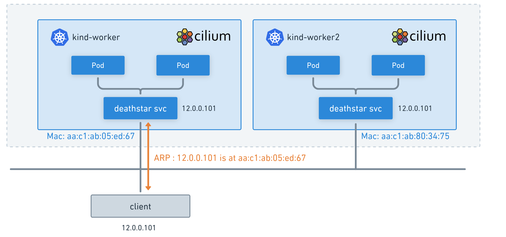
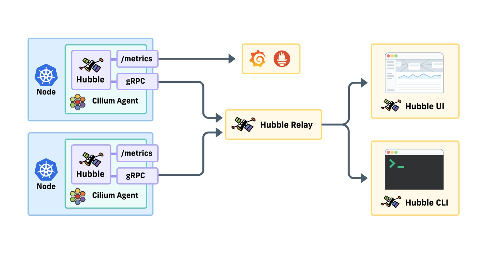
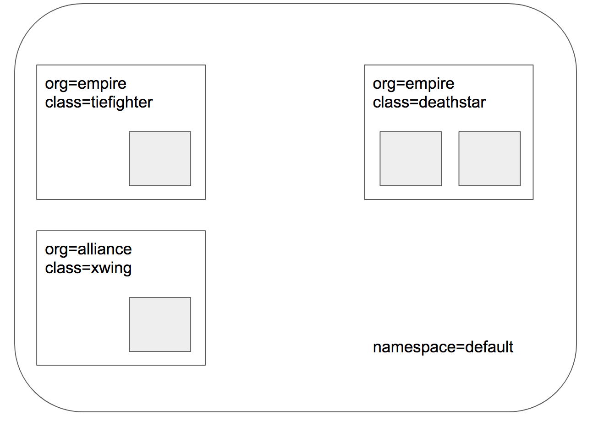
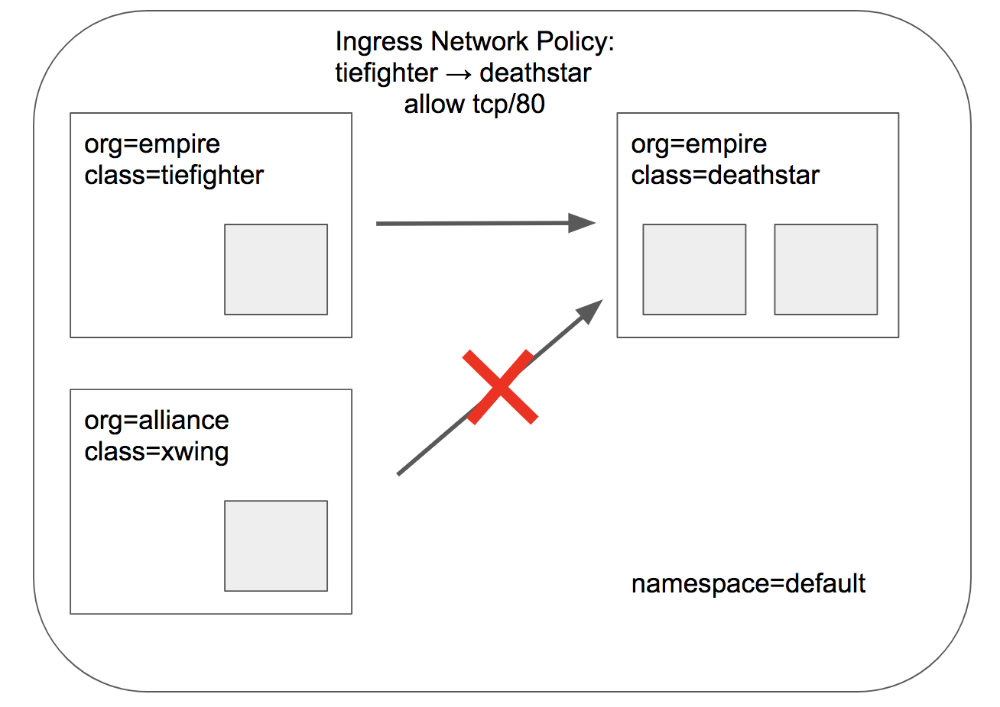
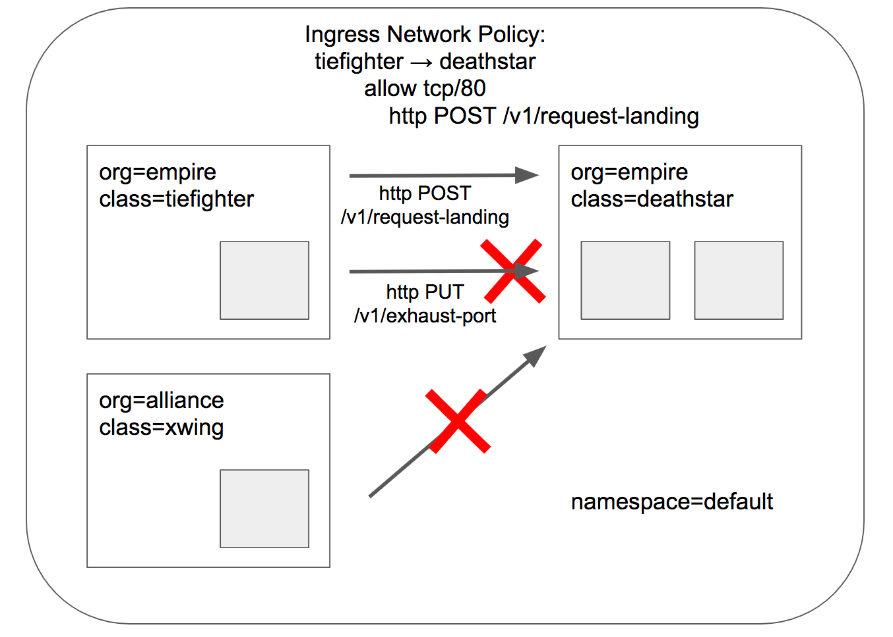
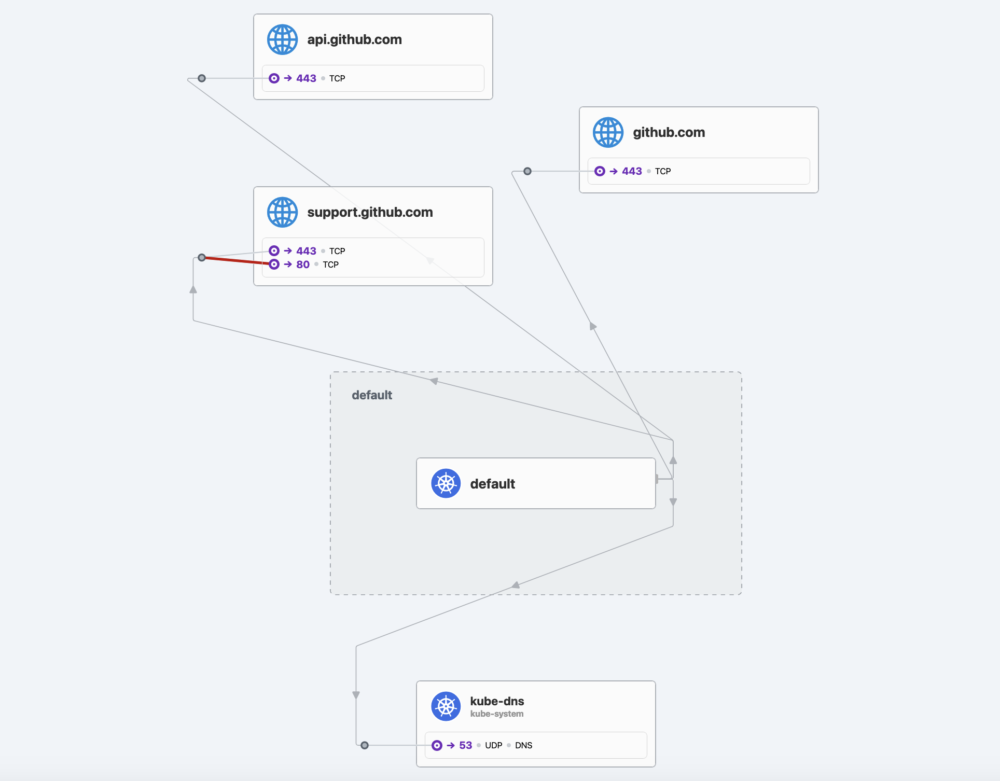

# Cilium


Cilium is a networking, observability, and security solution with an eBPF-based dataplane. It provides a simple flat Layer 3 network (OSI Model) with the ability to span multiple clusters in either a native routing or overlay mode. It is L7-protocol aware and can enforce network policies on L3-L7 using an identity based security model that is decoupled from network addressing.

Cilium implements distributed load balancing for traffic between pods and to external services, and is able to fully replace `kube-proxy`, using efficient hash tables in eBPF allowing for almost unlimited scale. It also supports advanced functionality like integrated ingress and egress gateway, bandwidth management and service mesh, and provides deep network and security visibility and monitoring.

A new Linux kernel technology called `eBPF` is at the foundation of Cilium. It supports dynamic insertion of eBPF bytecode into the Linux kernel at various integration points such as: network IO, application sockets, and tracepoints to implement security, networking and visibility logic. eBPF is highly efficient and flexible. To learn more about eBPF, visit `eBPF.io`.


This is an overview of the main functionalities of Cilium:

* Protect and secure APIs transparently
* Secure service to service communication based on identities
* Secure access to and from external services
* Simple Networking
* Load Balancing
* Bandwidth Management
* Monitoring and Troubleshooting

## Components

A deployment of Cilium and Hubble consists of the following components running in a cluster:



### Cilium

#### The Cilium agent

The **Cilium agent** (`cilium-agent`) runs on each node in the cluster. At a high-level, the agent accepts configuration via Kubernetes or APIs that describes networking, service load-balancing, network policies, and visibility & monitoring requirements.

The Cilium agent listens for events from orchestration systems such as Kubernetes to learn when containers or workloads are started and stopped. It manages the eBPF programs which the Linux kernel uses to control all network access in / out of those containers.

#### The Cilium CLI client

The **Cilium CLI client** (`cilium`) is a command-line tool that is installed along with the Cilium agent. It interacts with the REST API of the Cilium agent running on the same node. The CLI allows inspecting the state and status of the local agent. It also provides tooling to directly access the eBPF maps to validate their state.

!!! note

    The in-agent Cilium CLI client described here **should not** be confused with the [command line tool](https://github.com/cilium/cilium-cli) for quick-installing, managing and troubleshooting Cilium on Kubernetes clusters, which also has the name cilium. That tool is typically installed remote from the cluster, and uses `kubeconfig` information to access Cilium running on the cluster via the Kubernetes API.

#### The Cilium operator

The **Cilium Operator** is responsible for managing duties in the cluster which should logically be handled once for the entire cluster, rather than once for each node in the cluster. The Cilium operator is not in the critical path for any forwarding or network policy decision. A cluster will generally continue to function if the operator is temporarily unavailable. However, depending on the configuration, failure in availability of the operator can lead to:

* Delays in IP Address Management (IPAM) and thus delay in scheduling of new workloads if the operator is required to allocate new IP addresses
* Failure to update the kvstore heartbeat key which will lead agents to declare kvstore unhealthiness and restart.

#### The CNI plugin

The **CNI plugin** (`cilium-cni`) is invoked by Kubernetes when a pod is scheduled or terminated on a node. It interacts with the Cilium API of the node to trigger the necessary datapath configuration to provide networking, load-balancing and network policies for the pod.

### Hubble

#### Hubble Server

The **Hubble server** runs on each node and retrieves the eBPF-based visibility from Cilium. It is embedded into the **Cilium agent** in order to achieve high performance and low-overhead. It offers a gRPC service to retrieve flows and Prometheus metrics.

#### Hubble Relay

**Hubble Relay** (`hubble-relay`) is a standalone component which is aware of all running Hubble servers and offers cluster-wide visibility by connecting to their respective gRPC APIs and providing an API that represents all servers in the cluster.

#### The Hubble CLI

The **Hubble CLI** (`hubble`) is a command-line tool able to connect to either the gRPC API of `hubble-relay` or the local server to retrieve flow events.

#### The Hubble UI

The **Hubble UI** (`hubble-ui`) utilizes relay-based visibility to provide a graphical service dependency and connectivity map.

### eBPF

Historically, the operating system has always been an ideal place to implement observability, security, and networking functionality due to the kernel's privileged ability to oversee and control the entire system. At the same time, an operating system kernel is hard to evolve due to its central role and high requirement towards stability and security. The rate of innovation at the operating system level has thus traditionally been lower compared to functionality implemented outside of the operating system.

**BPF** (Berkeley Packet Filter) is a revolutionary technology with origins in the Linux kernel that can run sandboxed programs in a privileged context such as the operating system kernel. It is used to safely and efficiently **extend** the capabilities of the **kernel** without requiring to change kernel source code or load kernel modules.

**eBPF** (extended Berkeley Packet Filter) is a modern Linux kernel bytecode interpreter originally introduced to filter network packets, e.g. tcpdump and socket filters at **runtime**. It has been extended with additional data structures such as hashtable and arrays as well as additional actions to support packet mangling, forwarding, encapsulation, etc. An in-kernel verifier ensures that eBPF programs are safe to run and a `Just-In-Time` (JIT) compiler converts the bytecode to CPU architecture specific instructions for native execution efficiency. eBPF programs can be run at various **hooking points** (events) in the kernel such as for incoming and outgoing packets, execute binaries, etc..


Today, **eBPF** is used extensively to drive a wide variety of use cases: Providing high-performance networking and load-balancing in modern data centers and cloud native environments, extracting fine-grained security observability data at low overhead, helping application developers trace applications and observability, providing insights for performance troubleshooting, preventive application and container runtime security enforcement, and much more. The possibilities are endless, and the innovation that eBPF is unlocking has only just begun.

Although **eBPF** was initially designed for the **kernel**, its tremendous potential in **user** space, coupled with the kernel's GPL LICENSE restrictions. These runtimes allowed developers to execute eBPF bytecode **outside** the kernel, breaking free from GPL license restrictions and offering a more intuitive and convenient debugging environment.



**Cilium** is capable of probing the Linux kernel for available features and will automatically make use of more recent features as they are detected.



### Data Store

Cilium requires a data store to propagate state between agents. It supports the following data stores:

#### Kubernetes CRDs (Default)

The default choice to store any data and propagate state is to use Kubernetes custom resource definitions (CRDs). CRDs are offered by Kubernetes for cluster components to represent configurations and state via Kubernetes resources.

#### Key-Value Store

All requirements for state storage and propagation can be met with Kubernetes CRDs as configured in the default configuration of Cilium. A key-value store can optionally be used as an optimization to improve the scalability of a cluster as change notifications and storage requirements are more efficient with direct key-value store usage.

The currently supported key-value stores are base on `etcd`.

## Feature

### Security

* Network Traffic
* File Activity
* Running Executables
* Changing Priviledges

## Features

### Routing

[Routing](https://docs.cilium.io/en/stable/network/concepts/routing/)

### Kube Proxy Replacement

The kube-proxy replacement offered by Cilium's CNI is a very powerful feature which can increase performance for large Kubernetes clusters. This feature uses an eBPF data plane to replace the kube-proxy implementations offered by Kubernetes distributions typically implemented with either iptables or ipvs. When using other networking infrastructure, the otherwise hidden Cilium eBPF implementation used to replace kube-proxy can bleed through and provide unintended behaviors. We see this when trying to use Istio service mesh with Cilium's kube-proxy replacement: kube-proxy replacement, by default, **breaks** Istio.

### LoadBalancer IP Address Management (LB-IPAM)

In Cilium 1.13, it was added support for **LoadBalancer IP Address Management** (LB-IPAM) and the ability to *allocate* IP addresses to Kubernetes Services of the type `LoadBalancer`.



For users who do not want to use **BGP** or that just want to make these IP addresses accessible over the **local network**, in Cilium 1.14 a new feature called **L2 Announcements** was added. When you deploy a *L2 Announcement Policy*, Cilium will start responding to `ARP` requests from local clients for ExternalIPs and/or LoadBalancer IPs.



!!! note

    Typically, this would have required a tool like `MetalLB` but Cilium now natively supports this functionality. Cilium doesn't use `MetalLB` anymore, now it uses its own `BGP` speaker made with `gobgp`. They used it initially until they reached feature parity with gobgp.

`LB-IPAM` works seamlessly with Cilium `BGP`. The IP addresses allocated by Cilium can be advertised to `BGP` peers to integrate your cluster with the rest of your network.

Cloud providers natively provide this feature for managed Kubernetes Services and therefore this feature is more one for self-managed Kubernetes deployments or home labs.

### BGP (Border Gateway Protocol)

BGP is a routing protocol.

DNS (domain name system) servers provide the IP address, but BGP provides the most efficient way to reach that IP address. Roughly speaking, if DNS is the Internet's address book, then BGP is the Internet's road map (Tomtom).

### Threat Model

[Threat Model](https://docs.cilium.io/en/latest/security/threat-model/)

### Observability

**Hubble** is a fully distributed networking and security observability platform. It is built on top of Cilium and eBPF to enable deep visibility into the communication and behavior of services as well as the networking infrastructure in a completely transparent manner.

By building on top of Cilium, Hubble can leverage eBPF for visibility. By relying on eBPF, all visibility is programmable and allows for a dynamic approach that minimizes overhead while providing deep and detailed visibility as required by users. Hubble has been created and specifically designed to make best use of these new eBPF powers.



Hubble can answer questions such as:

#### Service dependencies & communication map

* What services are communicating with each other? How frequently? What does the service dependency graph look like?
* What HTTP calls are being made? What Kafka topics does a service consume from or produce to?

#### Network monitoring & alerting

* Is any network communication failing? Why is communication failing? Is it DNS? Is it an application or network problem? Is the communication broken on layer 4 (TCP) or layer 7 (HTTP)?
* Which services have experienced a DNS resolution problem in the last 5 minutes? Which services have experienced an interrupted TCP connection recently or have seen connections timing out? What is the rate of unanswered TCP SYN requests?

#### Application monitoring

* What is the rate of 5xx or 4xx HTTP response codes for a particular service or across all clusters?
* What is the 95th and 99th percentile latency between HTTP requests and responses in my cluster? Which services are performing the worst? What is the latency between two services?

#### Security observability

* Which services had connections blocked due to network policy? What services have been accessed from outside the cluster? Which services have resolved a particular DNS name?

### Service Mesh

[Service Mesh](https://docs.cilium.io/en/stable/network/servicemesh/)

## Installation

These are specific instructions on how to install Cilium depending on the Kubernetes cluster. However, the cilium installer will attempt to automatically pick the best configuration options for you. Check other installation options for distribution/platform specific to choose the ideal default configuration for each.

### CLI

The Cilium CLI can be used to install Cilium, inspect the state of a Cilium installation, and enable/disable various features (e.g. clustermesh, Hubble).

Cilium cli can be installed in different ways using following [instructions](https://docs.cilium.io/en/stable/gettingstarted/k8s-install-default/).

```bash
# Use homebrew to install cilium cli
brew install cilium-cli

# Test the version
cilium version --client

cilium-cli: v0.16.4 compiled with go1.22.1 on darwin/arm64
cilium image (default): v1.15.3
cilium image (stable): v1.15.3
```

### CNI

There are several ways to install Cilium by using cilium cli, helm, kustomize, etc... In addition, cilium is recommended to be installed in a kubernetes distribution with no **CNI** pre-installed. There are several ways to prevent CNI to be installed in some distributions such as `K3s`, `KinD`, etc..

!!! note

    Depending on the kubernetes distribution GKE, AKS, EKS, Openshift, K3s, etc.. cilium need to be installed using custom configuration.

    ```bash
    # For K3s cluster it's necessary to disable current CNI (flannel) and Network Policies.
    curl -sfL https://get.k3s.io | INSTALL_K3S_EXEC='--flannel-backend=none --disable-network-policy' sh -
    ```

```bash
# Using the cilium cli, this will use helm behind the scenes.
cilium install --version 1.15.3

# Or Using directly helm
helm repo add cilium https://helm.cilium.io/
helm install cilium cilium/cilium --version 1.15.3 \
   --namespace kube-system \
   --set operator.replicas=1
```

!!! Restart Unmanaged Pods

    If you did not create a cluster with the nodes tainted with the taint `node.cilium.io/agent-not-ready`, then unmanaged pods **need** to be restarted manually. Restart all already running pods which are not running in host-networking mode to ensure that Cilium starts managing them. This is required to ensure that all pods which have been running before Cilium was deployed have network connectivity provided by Cilium and NetworkPolicy applies to them.

    ```bash
    kubectl get pods --all-namespaces -o custom-columns=NAMESPACE:.metadata.namespace,NAME:.metadata.name,HOSTNETWORK:.spec.hostNetwork --no-headers=true | grep '<none>' | awk '{print "-n "$1" "$2}' | xargs -L 1 -r kubectl delete pod
    ```

Validate Cilium has been properly installed into kubernetes cluster running following command.

```bash
# Check cilium status by using the following command
cilium status --wait -n networking

    /¯¯\
 /¯¯\__/¯¯\    Cilium:             OK
 \__/¯¯\__/    Operator:           OK
 /¯¯\__/¯¯\    Envoy DaemonSet:    disabled (using embedded mode)
 \__/¯¯\__/    Hubble Relay:       OK
    \__/       ClusterMesh:        disabled

Deployment             hubble-ui          Desired: 1, Ready: 1/1, Available: 1/1
Deployment             cilium-operator    Desired: 1, Ready: 1/1, Available: 1/1
Deployment             hubble-relay       Desired: 1, Ready: 1/1, Available: 1/1
DaemonSet              cilium             Desired: 3, Ready: 3/3, Available: 3/3
Containers:            hubble-relay       Running: 1
                       cilium             Running: 3
                       hubble-ui          Running: 1
                       cilium-operator    Running: 1
Cluster Pods:          5/5 managed by Cilium
Helm chart version:
Image versions         hubble-relay       quay.io/cilium/hubble-relay:v1.15.3@sha256:b9c6431aa4f22242a5d0d750c621d9d04bdc25549e4fb1116bfec98dd87958a2: 1
                       cilium             quay.io/cilium/cilium:v1.15.3@sha256:da74ab61d1bc665c1c088dff41d5be388d252ca5800f30c7d88844e6b5e440b0: 3
                       hubble-ui          quay.io/cilium/hubble-ui:v0.13.0@sha256:7d663dc16538dd6e29061abd1047013a645e6e69c115e008bee9ea9fef9a6666: 1
                       hubble-ui          quay.io/cilium/hubble-ui-backend:v0.13.0@sha256:1e7657d997c5a48253bb8dc91ecee75b63018d16ff5e5797e5af367336bc8803: 1
                       cilium-operator    quay.io/cilium/operator-generic:v1.15.3@sha256:c97f23161906b82f5c81a2d825b0646a5aa1dfb4adf1d49cbb87815079e69d61: 1

# Check cilium configuration options
cilium config view -n networking

# Filter configuration by keyword
cilium config view -n networking  | grep l2

enable-l2-announcements                           true
enable-l2-neigh-discovery                         true
```

Run the following command to validate that your cluster has proper network connectivity.

```bash
# Check the connectivity test
cilium connectivity test -n networking

# Check for any errors occurs during the tests.
```

### Hubble

Observability is provided by **Hubble** which enables deep visibility into the communication and behavior of services as well as the networking infrastructure in a completely transparent manner.

By default, **Hubble API** operates within the scope of the individual node on which the Cilium agent runs. This confines the network insights to the traffic observed by the local Cilium agent. Hubble CLI (`hubble`) can be used to query the Hubble API provided via a local Unix Domain Socket. The Hubble CLI binary is installed by default on Cilium agent pods.

Upon deploying **Hubble Relay**, network visibility is provided for the entire cluster or even multiple clusters in a ClusterMesh scenario. In this mode, Hubble data can be accessed by directing Hubble CLI (`hubble`) to the Hubble Relay service or via Hubble UI. Hubble UI is a web interface which enables automatic discovery of the services dependency graph at the L3/L4 and even L7 layer, allowing user-friendly visualization and filtering of data flows as a service map.

First you will need to install `hubble relay` and `hubble ui` into Kubernetes.

!!! note

    Cilium installer allows to configure `hubble` service with TLS, metrics, port and other features.

```bash
# Cilium must be installed previously in order to be install new features from cli

# Using cilium cli (without ui)
cilium hubble enable

# Enable cilium with ui (hubble must be disabled)
cilium hubble enable --ui

#Updated helm by enabling specific hubble features.
helm upgrade cilium cilium/cilium --version 1.15.3 \
   --namespace kube-system \
   --reuse-values \
   --set hubble.relay.enabled=true \
   --set hubble.ui.enabled=true
```

Install `hubble` cli to interact with Hubble API for observability and troubleshooting.

```bash
# Install hubble using homebrew
brew install hubble
```

Validate the hubble installation

```bash
# Expose the Hubble API by using Port forward on port :4245
cilium hubble port-forward -n networking

# In another terminal use following command to test the hubble status
hubble status

# List all nodes
hubble list nodes

NAME       STATUS      AGE       FLOWS/S   CURRENT/MAX-FLOWS
server-1   Connected   5h7m50s   14.09     4095/4095 (100.00%)
server-2   Connected   5h7m56s   19.43     4095/4095 (100.00%)
server-3   Connected   5h7m49s   14.04     4095/4095 (100.00%)

# You can also query the flow API and look for flows
hubble observe
```

Open the Hubble UI using cilium cli

```bash
# Use following command for port forwarding (port 12000)
cilium hubble ui -n networking

# Run the cilium test to get some traffic (different terminal)
while true; do cilium connectivity test -n networking; done

# http://localhost:12000/
```

## Demo

In the Star Wars-inspired example from Cilium, there are three microservices applications: `deathstar`, `tiefighter`, and `xwing`.

* The `deathstar` runs an HTTP webservice on port 80, which is exposed as a Kubernetes `Service` to load-balance requests to `deathstar` across two pod replicas. The deathstar service provides landing services to the empire's spaceships so that they can request a landing port.
* The `tiefighter` pod represents a landing-request client service on a typical `empire` ship.
* The `xwing` represents a similar service on an `alliance` ship.



They exist so that we can test different **security policies** for access control to deathstar landing services.

### Deployment

The file `http-sw-app.yaml` contains a Kubernetes Deployment for each of the three services. Each deployment is identified using the Kubernetes labels (`org=empire, class=deathstar`), (`org=empire, class=tiefighter`), and (`org=alliance, class=xwing`). It also includes a `deathstar-service`, which load-balances traffic to all pods with label (`org=empire, class=deathstar`).

This is an example of the `deathstar` deployment with the labels `org=empire, class=deathstar`.

```yaml title="http-sw-app.yaml" hl_lines="16-17"
--8<-- "https://raw.githubusercontent.com/jsa4000/homelab-ops/main/docs/_source/layers/networking/cilium/http-sw-app.yaml:deathstar"
```

```bash
# Deploy the base demo resources into default namespace
kubectl create -f https://raw.githubusercontent.com/jsa4000/homelab-ops/main/docs/_source/layers/networking/cilium/http-sw-app.yaml

service/deathstar created
deployment.apps/deathstar created
pod/tiefighter created
pod/xwing created

# Get resources deployeed
kubectl get,services pods

# Check the pod statuses
kubectl get pods -w
```

Each `pod` will be represented in Cilium as an `Endpoint` in the local cilium agent. We can invoke the cilium tool inside the Cilium pod to list them (in a single-node installation `kubectl -n networking exec ds/cilium -- cilium-dbg endpoint list` lists them all, but in a multi-node installation, only the ones running on the same node will be listed)

Get the ingress and egress enforcements policies with the identities and labels assigned by cilium currently applied to these pods/endpoints.

```bash
# List all endpoints (pods) available in the current node (each agent manage it's own pods)
kubectl -n networking exec ds/cilium -- cilium-dbg endpoint list

Defaulted container "cilium-agent" out of: cilium-agent, config (init), mount-cgroup (init), apply-sysctl-overwrites (init), mount-bpf-fs (init), clean-cilium-state (init), install-cni-binaries (init)
ENDPOINT   POLICY (ingress)   POLICY (egress)   IDENTITY   LABELS (source:key[=value])                                              IPv6   IPv4          STATUS
           ENFORCEMENT        ENFORCEMENT

1453       Disabled           Disabled          45221      k8s:app.kubernetes.io/name=deathstar                                            10.52.1.208   ready
                                                           k8s:class=deathstar
                                                           k8s:io.cilium.k8s.namespace.labels.kubernetes.io/metadata.name=default
                                                           k8s:io.cilium.k8s.policy.cluster=default
                                                           k8s:io.cilium.k8s.policy.serviceaccount=default
                                                           k8s:io.kubernetes.pod.namespace=default
                                                           k8s:org=empire

# This information can be also gotten from CRD (ciliumnetworkpolicy or cnp)
kubectl get cep
kubectl get cep -o wide

NAME                        SECURITY IDENTITY   INGRESS ENFORCEMENT   EGRESS ENFORCEMENT   VISIBILITY POLICY   ENDPOINT STATE   IPV4          IPV6
deathstar-b4b8ccfb5-w84sn   6822                <status disabled>     <status disabled>    <status disabled>   ready            10.52.1.239
deathstar-b4b8ccfb5-f75xw   6822                <status disabled>     <status disabled>    <status disabled>   ready            10.52.2.36
tiefighter                  25698               <status disabled>     <status disabled>    <status disabled>   ready            10.52.2.26
xwing                       63406               <status disabled>     <status disabled>    <status disabled>   ready            10.52.1.220

```

### Check Current Access

From the perspective of the `deathstar` service, only the ships with label `org=empire` are allowed to connect and request landing. Since we have no rules enforced, both `xwing` and `tiefighter` will be able to request landing. To test this, use the commands below.

```bash
# Check connectivity between xwing and deathstar
kubectl exec xwing -- curl -s -XPOST deathstar.default.svc.cluster.local/v1/request-landing
Ship landed

# Check connectivity between tiefighter and deathstar
kubectl exec tiefighter -- curl -s -XPOST deathstar.default.svc.cluster.local/v1/request-landing
Ship landed
```

### Apply an L3/L4 Policy

When using Cilium, endpoint *IP addresses* are **irrelevant** when defining security policies. Instead, you can use the **labels** assigned to the pods to define security policies. The policies will be applied to the right `pods` based on the labels irrespective of where or when it is running within the cluster.

We'll start with the basic policy restricting deathstar landing requests to only the ships that have label (`org=empire`). This will not allow any ships that don't have the `org=empire` label to even connect with the deathstar service. This is a simple policy that filters only on IP protocol (`network layer 3`) and TCP protocol (`network layer 4`), so it is often referred to as an **L3/L4 network security policy**.

!!! note

    Once a `NetworkPolicy` has been applied it **denies** automatically the connections that do not satisfied this policy. It's recommended to set a **Zero Trust Security** policy at a cluster level to deny every connection and start adding Network Policies to enable the **trusted** connections.

    The `CiliumNetworkPolicy` is an upgrade from the standard kubernetes `NetworkPolicy`. There are two flavours of `NetworkPolicies` in Cilium, `CiliumNetworkPolicy` and `CiliumClusterwideNetworkPolicy`. There are a couple of things you can't do with the `NetworkPolicy` resource:

    * You can't use L7 rules - for example, you can't use HTTP methods, headers, or paths in your policies.
    * Anything TLS related
    * You can't write node-specific policies
    * You can't write deny policies and more



This **Endpoint Based** Policy will restrict any `ingress` network connections to `endpoints` (`pods`) with labels `class: deathstar` and `org: empire`, so it only allows incoming traffic from `endpoints` with labels `org=empire` on port `80`.

!!! note

    The layer 3 policy establishes the base connectivity rules regarding which endpoints can talk to each other. Layer 3 policies can be specified using the following methods: **Endpoints Based**, **Services based**, **Entities Based**, **IP/CIDR based** and **DNS based**. Check this [link](https://docs.cilium.io/en/latest/security/policy/language/) for more documentation.

```yaml title="sw_l3_l4_policy_endpoint.yaml" hl_lines="9-10 12-14"
--8<-- "docs/_source/layers/networking/cilium/sw_l3_l4_policy_endpoint.yaml"
```

```bash
# Create CiliumNetworkPolicy resource
kubectl create -f docs/_source/layers/networking/cilium/sw_l3_l4_policy.yaml

# This information can be also gotten from CRD (ciliumnetworkpolicy or cnp)
kubectl get cnp

# Delete the policy to return to previous state
kubectl delete cnp rule1
```

Instead a Service Based policiy can also be applied to enforce network traffic that goes from an endpoint to a specific services or endpoints (`egress`).

```yaml title="sw_l3_l4_policy_service.yaml" hl_lines="9-10 15-17 31-32 37-39"
--8<-- "docs/_source/layers/networking/cilium/sw_l3_l4_policy_service.yaml"
```

```bash
# Create CiliumNetworkPolicy resource
kubectl create -f docs/_source/layers/networking/cilium/sw_l3_l4_policy_service.yaml

# This information can be also gotten from CRD (ciliumnetworkpolicy or cnp)
kubectl get cnp

# Delete the policy to return to previous state
kubectl delete cnp rule1
kubectl delete cnp rule2
```

Now if we run the landing requests again, only the tiefighter pods with the label `org=empire` will succeed. The xwing pods will be blocked!

```bash
# tiefighter pods with the label org=empire will succeed
kubectl exec tiefighter -- curl -s -XPOST deathstar.default.svc.cluster.local/v1/request-landing
Ship landed

# xwing pods with the label org!=empire will not succeed
kubectl exec xwing -- curl -s -XPOST deathstar.default.svc.cluster.local/v1/request-landing

# Connection Hangs or Timeout
```

### Inspecting the Policy

If we run cilium-dbg endpoint list again we will see that the pods with the label `org=empire` and `class=deathstar` now have ingress policy enforcement `enabled` as per the policy above.

```bash
# Check policy enabled on deathstar endpoint
kubectl -n networking exec ds/cilium -- cilium-dbg endpoint list

Defaulted container "cilium-agent" out of: cilium-agent, config (init), mount-cgroup (init), apply-sysctl-overwrites (init), mount-bpf-fs (init), clean-cilium-state (init), install-cni-binaries (init)
ENDPOINT   POLICY (ingress)   POLICY (egress)   IDENTITY   LABELS (source:key[=value])                                              IPv6   IPv4          STATUS
           ENFORCEMENT        ENFORCEMENT

1453       Enabled            Disabled          45221      k8s:app.kubernetes.io/name=deathstar                                            10.52.1.208   ready
                                                           k8s:class=deathstar
                                                           k8s:io.cilium.k8s.namespace.labels.kubernetes.io/metadata.name=default
                                                           k8s:io.cilium.k8s.policy.cluster=default
                                                           k8s:io.cilium.k8s.policy.serviceaccount=default
                                                           k8s:io.kubernetes.pod.namespace=default
                                                           k8s:org=empire

# This information can be also gotten from CRD (ciliumnetworkpolicy or cnp)
kubectl get cep
kubectl get cep -o wide
```

### Apply and Test HTTP-aware L7 Policy

In the simple scenario above, it was sufficient to either give `tiefighter` / `xwing` full access to deathstar's API or no access at all. But to provide the strongest security (i.e., enforce least-privilege isolation) between microservices, each service that calls deathstar's API should be limited to making only the set of HTTP requests it requires for legitimate operation.

For example, consider that the deathstar service exposes some maintenance APIs which should not be called by random empire ships.



```bash
# force an error calling to /v1/exhaust-port
kubectl exec tiefighter -- curl -s -XPUT deathstar.default.svc.cluster.local/v1/exhaust-port

Panic: deathstar exploded

goroutine 1 [running]:
main.HandleGarbage(0x2080c3f50, 0x2, 0x4, 0x425c0, 0x5, 0xa)
        /code/src/github.com/empire/deathstar/
        temp/main.go:9 +0x64
main.main()
        /code/src/github.com/empire/deathstar/
        temp/main.go:5 +0x85
```

Cilium is capable of enforcing HTTP-layer (i.e., L7) policies to limit what URLs the tiefighter is allowed to reach. Here is an example policy file that extends our original policy by limiting tiefighter to making only a POST /v1/request-landing API call, but disallowing all other calls (including PUT /v1/exhaust-port).

```yaml title="sw_l3_l4_policy_endpoint.yaml" hl_lines="9-10 14"
--8<-- "docs/_source/layers/networking/cilium/sw_l3_l4_l7_policy.yaml"
```

Update the existing rule to apply L7-aware policy to protect deathstar using.

```bash
# Create CiliumNetworkPolicy resource
kubectl apply -f docs/_source/layers/networking/cilium/sw_l3_l4_l7_policy.yaml
```

We can now re-run the same test as above, but we will see a different outcome.

```bash
# Connection successful
kubectl exec tiefighter -- curl -s -XPOST deathstar.default.svc.cluster.local/v1/request-landing
Ship landed

# Access denied because L7 Policy
kubectl exec tiefighter -- curl -s -XPUT deathstar.default.svc.cluster.local/v1/exhaust-port
Access denied

# Connection Failed because L3-L4 Policy
kubectl exec xwing -- curl -s -XPOST deathstar.default.svc.cluster.local/v1/request-landing

```

!!! note

    As you can see, with Cilium L7 security policies, we are able to permit `tiefighter` to access only the required API resources on `deathstar`, thereby implementing a **least privilege** security approach for communication between microservices. Note that path matches the exact url, if for example you want to allow anything under `/v1/`, you need to use a regular expression.

    ```bash
    path: "/v1/.*"
    ```

### Locking Down External Access with DNS-Based Policies

**DNS-based** policies are very useful for controlling access to services running **outside** the Kubernetes cluster. DNS acts as a persistent service identifier for both external services provided by AWS, Google, Twilio, Stripe, etc., and internal services such as database clusters running in private subnets outside Kubernetes. CIDR or IP-based policies are cumbersome and hard to maintain as the IPs associated with external services can change frequently. The Cilium **DNS-based** policies provide an easy mechanism to specify access control while Cilium manages the harder aspects of tracking DNS to IP mapping.

In this example we will take a look to a simple scenario where the Empire's `mediabot` pods need access to `GitHub` for managing the Empire's git repositories. The pods **shouldn't** have access to any other external service.



Deploy `mediabot` pod that will attempt to connect to github.

```bash
# Create CiliumNetworkPolicy resource
kubectl create -f docs/_source/layers/networking/cilium/dns-sw-app.yaml
```

#### Apply DNS Egress Policy

!!! note

    Since pods needs to resolve DNS or FQDN into IP Address it's necessary to allow access to kube-dns `endpoint/pod` (allow DNS lookups). Once the policy is apply it **denies** the rest of the incoming and outcoming traffic that do not match with it.

    **OpenShift** users will need to modify the policies to match the namespace` openshift-dns` (instead of `kube-system`), remove the match on the `k8s:k8s-app=kube-dns` label, and change the port to `5353`.

```yaml title="dns-matchname.yaml" hl_lines="11-12 14-16 21-23"
--8<-- "docs/_source/layers/networking/cilium/dns-matchname.yaml"
```

1. The first egress section uses `toFQDNs:` matchName specification to allow egress to `api.github.com`. The destination DNS should match exactly the name specified in the rule. The endpointSelector allows only pods with labels `class: mediabot`, `org:empire` to have the egress access.
2. The second egress section (`toEndpoints`) allows `mediabot` pods to access `kube-dns` service. Note that `rules: dns` instructs Cilium to inspect and allow DNS lookups matching specified patterns. In this case, inspect and allow all DNS queries.

Apply DNS policy using DNS strict match

```bash
# Apply the DNS Polidy
kubectl apply -f docs/_source/layers/networking/cilium/dns-matchname.yaml
```

Testing the policy, we see that `mediabot` has access to `api.github.com` but doesn't have access to any other external service, e.g., `support.github.com`.

```bash
# Verify the DNS match with the policy applied
kubectl exec mediabot -- curl -I -s https://api.github.com | head -1
HTTP/2 200

# Verify the DNS does not match with the policy applied
kubectl exec mediabot -- curl -I -s --max-time 5 https://support.github.com | head -1

# The connections it's blocked by cilium

```

#### DNS Policies Using Patterns

The above policy controlled DNS access based on exact match of the DNS domain name. Often, it is required to allow access to a subset of domains. Let's say, in the above example, mediabot pods need access to any GitHub sub-domain, e.g., the pattern `*.github.com`. We can achieve this easily by changing the `toFQDN` rule to use `matchPattern` instead of `matchName`.

```yaml title="dns-pattern.yaml" hl_lines="12"
--8<-- "docs/_source/layers/networking/cilium/dns-pattern.yaml"
```

Apply DNS policy using a pattern instead

```bash
# Apply the DNS Policy with wildcards
kubectl apply -f docs/_source/layers/networking/cilium/dns-pattern.yaml
```

Test that `mediabot` has access to multiple **GitHub** services for which the DNS matches the pattern `*.github.com`.

!!! note

    It is important to note and test that this doesn't allow access to `github.com` because the `*.` in the pattern requires one subdomain to be present in the DNS name. You can simply add more `matchName` and `matchPattern` clauses to extend the access. (See DNS based policies to learn more about specifying DNS rules using patterns and names.)

```bash
# Verify the DNS match with the policy applied
kubectl exec mediabot -- curl -I -s https://api.github.com | head -1
HTTP/2 200

# Verify the DNS match with the policy applied
kubectl exec mediabot -- curl -I -s --max-time 5 https://support.github.com | head -1
HTTP/2 302

# Verify the DNS does not match with the policy applied
kubectl exec mediabot -- curl -I -s --max-time 5 https://github.com | head -1

# The connections it's blocked by cilium
```

#### Combining DNS, Port and L7 Rules

The DNS-based policies can be combined with port (L4) and API (L7) rules to further restrict the access. In our example, we will restrict `mediabot` pods to access GitHub services only on ports `443`. The `toPorts` section in the policy below achieves the port-based restrictions along with the DNS-based policies.

```yaml title="dns-port.yaml" hl_lines="14-17"
--8<-- "docs/_source/layers/networking/cilium/dns-port.yaml"
```

Apply DNS policy using a pattern instead

```bash
# Apply the DNS Policy with ports
kubectl apply -f docs/_source/layers/networking/cilium/dns-port.yaml
```

Test that `mediabot` has access to multiple **GitHub** services for which the DNS matches both `github.com` and pattern `*.github.com`. The access on port `443` will succeed but the access on port `80` will be denied.

```bash
# Verify the DNS match with the policy applied on port 443
kubectl exec mediabot -- curl -I -s https://api.github.com | head -1
HTTP/2 200

# Verify the DNS match with the policy applied on port 443
kubectl exec mediabot -- curl -I -s --max-time 5 https://support.github.com | head -1
HTTP/2 302

# Verify the DNS match with the policy applied on port 443
kubectl exec mediabot -- curl -I -s --max-time 5 https://github.com | head -1

# Verify the DNS match with the policy applied on port 80
kubectl exec mediabot -- curl -I -s --max-time 5 http://support.github.com | head -1

# The connections it's blocked by cilium
```

### Inspecting the cluster's network traffic with Hubble Relay

Let's now inspect this traffic using the CLI. The command below filters all traffic on the application layer (L7, HTTP) to the `deathstar` pod.

```bash
# Observe HTTP traffic from deathstar pod
hubble observe --pod deathstar --protocol http

Apr  5 21:03:13.283: default/tiefighter:42746 (ID:25698) -> default/deathstar-b4b8ccfb5-w84sn:80 (ID:6822) http-request FORWARDED (HTTP/1.1 POST http://deathstar.default.svc.cluster.local/v1/request-landing)
Apr  5 21:03:13.283: default/tiefighter:42746 (ID:25698) <- default/deathstar-b4b8ccfb5-w84sn:80 (ID:6822) http-response FORWARDED (HTTP/1.1 200 1ms (POST http://deathstar.default.svc.cluster.local/v1/request-landing))
Apr  5 21:03:15.919: default/tiefighter:44396 (ID:25698) -> default/deathstar-b4b8ccfb5-f75xw:80 (ID:6822) http-request DROPPED (HTTP/1.1 PUT http://deathstar.default.svc.cluster.local/v1/exhaust-port)
Apr  5 21:03:15.919: default/tiefighter:44396 (ID:25698) <- default/deathstar-b4b8ccfb5-f75xw:80 (ID:6822) http-response FORWARDED (HTTP/1.1 403 0ms (PUT http://deathstar.default.svc.cluster.local/v1/exhaust-port))

# Observe al DROPPED traffic from deathstar pod
hubble observe --pod deathstar --verdict DROPPED

Apr  5 21:03:15.919: default/tiefighter:44396 (ID:25698) -> default/deathstar-b4b8ccfb5-f75xw:80 (ID:6822) http-request DROPPED (HTTP/1.1 PUT http://deathstar.default.svc.cluster.local/v1/exhaust-port)
Apr  5 21:03:18.803: default/xwing:45706 (ID:63406) <> default/deathstar-b4b8ccfb5-f75xw:80 (ID:6822) policy-verdict:none INGRESS DENIED (TCP Flags: SYN)
Apr  5 21:03:18.803: default/xwing:45706 (ID:63406) <> default/deathstar-b4b8ccfb5-f75xw:80 (ID:6822) Policy denied DROPPED (TCP Flags: SYN)
Apr  5 21:03:19.820: default/xwing:45706 (ID:63406) <> default/deathstar-b4b8ccfb5-f75xw:80 (ID:6822) policy-verdict:none INGRESS DENIED (TCP Flags: SYN)
Apr  5 21:03:19.820: default/xwing:45706 (ID:63406) <> default/deathstar-b4b8ccfb5-f75xw:80 (ID:6822) Policy denied DROPPED (TCP Flags: SYN)
Apr  5 21:03:21.836: default/xwing:45706 (ID:63406) <> default/deathstar-b4b8ccfb5-f75xw:80 (ID:6822) policy-verdict:none INGRESS DENIED (TCP Flags: SYN)
Apr  5 21:03:21.836: default/xwing:45706 (ID:63406) <> default/deathstar-b4b8ccfb5-f75xw:80 (ID:6822) Policy denied DROPPED (TCP Flags: SYN)
Apr  5 21:03:25.965: default/xwing:45706 (ID:63406) <> default/deathstar-b4b8ccfb5-f75xw:80 (ID:6822) policy-verdict:none INGRESS DENIED (TCP Flags: SYN)
Apr  5 21:03:25.965: default/xwing:45706 (ID:63406) <> default/deathstar-b4b8ccfb5-f75xw:80 (ID:6822) Policy denied DROPPED (TCP Flags: SYN)
Apr  5 21:03:34.156: default/xwing:45706 (ID:63406) <> default/deathstar-b4b8ccfb5-f75xw:80 (ID:6822) policy-verdict:none INGRESS DENIED (TCP Flags: SYN)
Apr  5 21:03:34.156: default/xwing:45706 (ID:63406) <> default/deathstar-b4b8ccfb5-f75xw:80 (ID:6822) Policy denied DROPPED (TCP Flags: SYN)
Apr  5 21:03:50.285: default/xwing:45706 (ID:63406) <> default/deathstar-b4b8ccfb5-f75xw:80 (ID:6822) policy-verdict:none INGRESS DENIED (TCP Flags: SYN)
Apr  5 21:03:50.285: default/xwing:45706 (ID:63406) <> default/deathstar-b4b8ccfb5-f75xw:80 (ID:6822) Policy denied DROPPED (TCP Flags: SYN)
```

## Labs

* [IPAM and L2 Service Announcement Lab](https://isovalent.com/labs/cilium-lb-ipam-l2-announcements/)

## References

* [Kubernetes LoadBalance service using Cilium BGP control plane](https://medium.com/@valentin.hristev/kubernetes-loadbalance-service-using-cilium-bgp-control-plane-8a5ad416546a)
* [Migrating from MetaLB to Cilium](https://blog.stonegarden.dev/articles/2023/12/migrating-from-metallb-to-cilium/)
* [Getting Started with the Star Wars Demo](https://docs.cilium.io/en/stable/gettingstarted/demo/)
