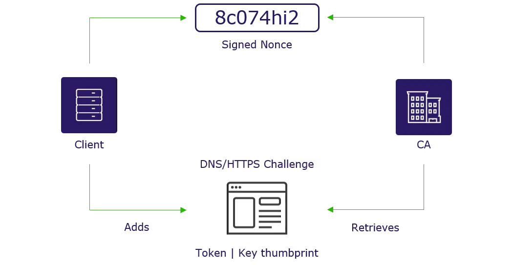
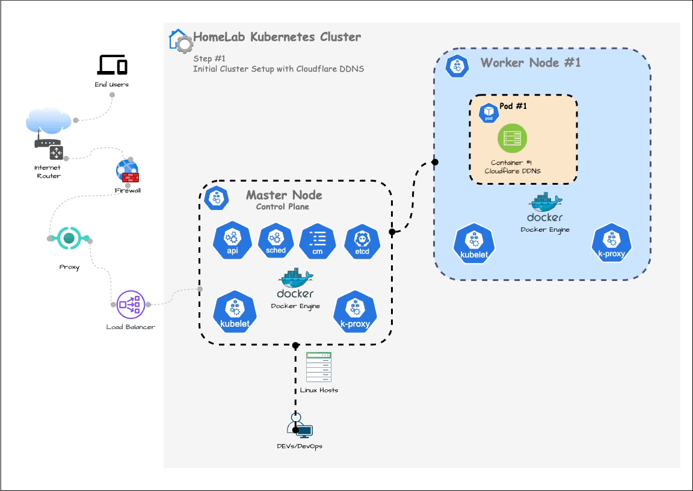
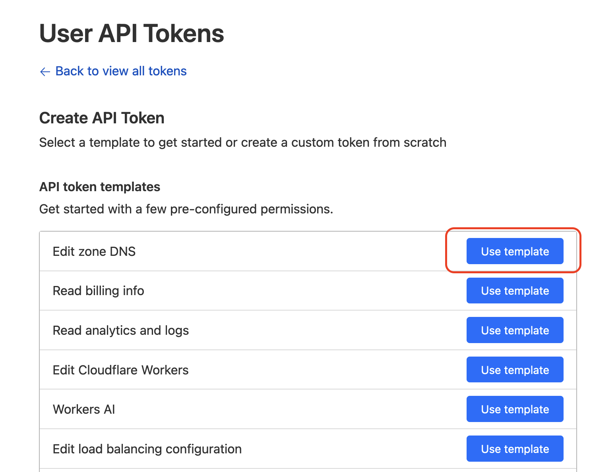
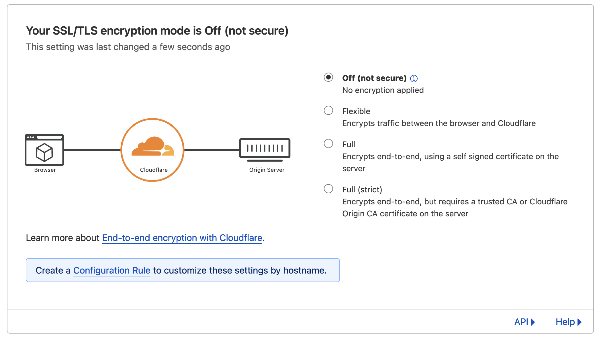
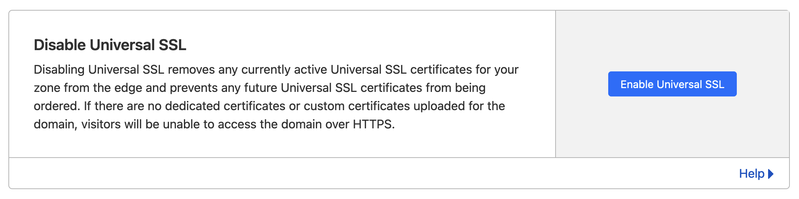
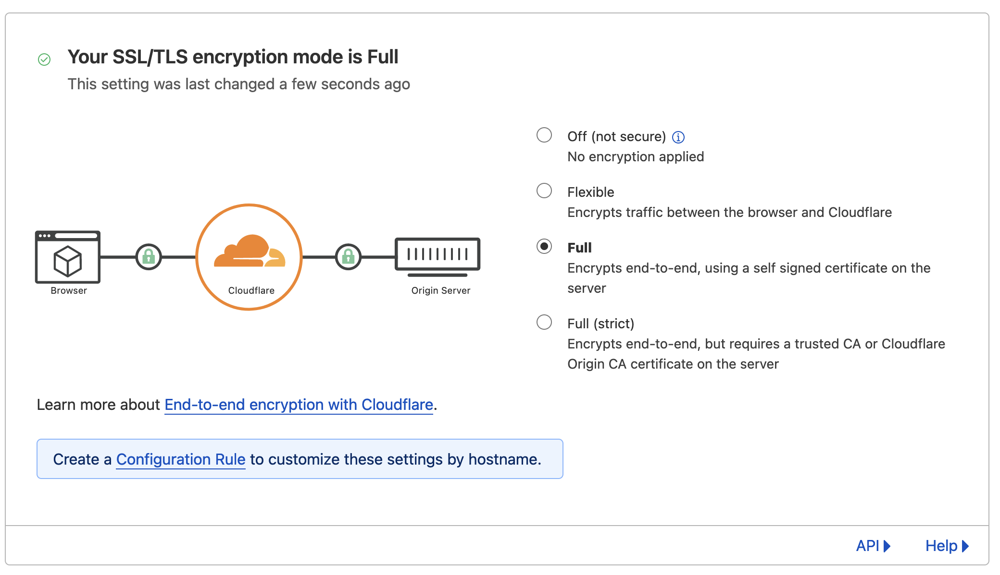
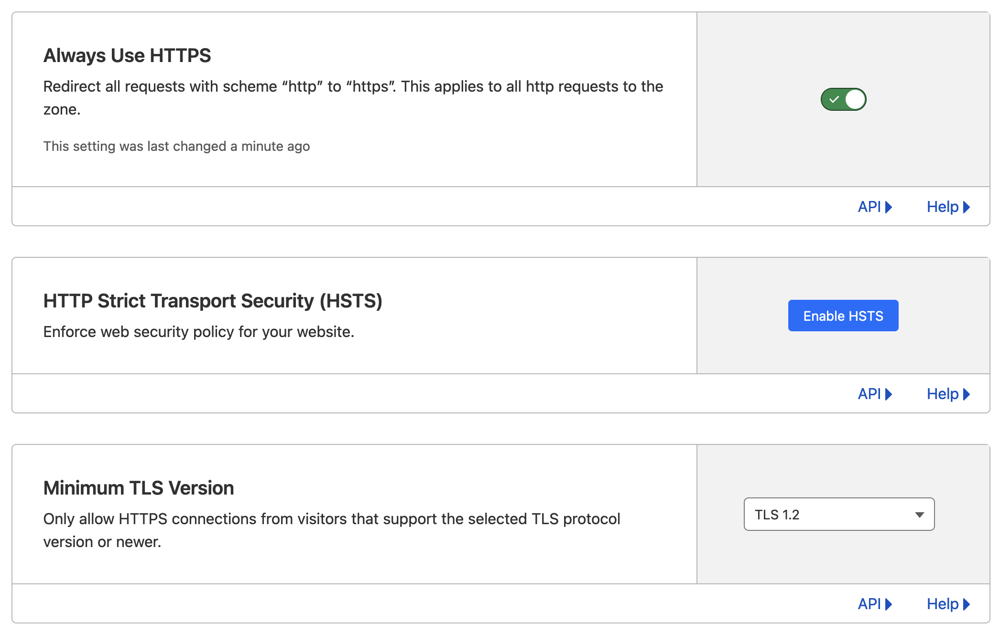

# DDNS (Dynamic DNS)

As a solution to the frequently changing IP address of your residential connection, we use **Dynamic DNS (DDNS)**. DDNS is a service that periodically (typically every few minutes) updates the domain registration information with the currently accessible IP address by detecting changes in the actual IP address (public IP address) provided by your ISP. The operation of DDNS is based on the method defined in the **ACME (Automatic Certificate Management Environment) RFC8555 standard**, many domain registrars (or DNS service providers) may use slightly different implementation methods, but essentially they follow the same RFC standard.

!!! note

    **Internet Service Providers (ISPs)** assign dynamic IP addresses to residential internet connections, which means that the assigned IP address to you can change at any time. Consequently, relying on accessing your services via the IP address from external sources does not guarantee a stable service. Additionally, to apply SSL HTTPS security (using SSL certificates), you need to utilize an internet domain that you own or have administrative control over. From this point forward, we assume that you have your own domain.

First, check if your domain registrar or DNS service provider supports Dynamic DNS. Many domain registrars offer support for DDNS. GoDaddy, Cloudflare, etc.

To ensure secure usage of your cluster, it is now considered standard practice to use encrypted HTTPS based on TLS certificates. If you currently do not have a domain to use, I'd recommended to have your own top-level domain for around $15 per year as one of your digital identity.

## DNS Management

### Cloudflare

Cloudflare is a well-known company in the industry, primarily recognized for its CDN and other network-related services. However, as a domain registrar, it also offers convenient and useful features to end users (even in their free tier), such as basic DDoS protection, proxy services, and DDNS functionality.

Cloudflare provides DNS capabilities such as renew registration, update settings, and edit WHOIS contacts for domains registered with Cloudflare, or transfer to another registrar. In order to use the API for DNS management is needed to create an API Token (or legacy API Keys).

Following the step to use Cloudflare DDNS on the existing K8s cluster and set it up according to your domain.

#### Create API Token

Create API Token for DNS Management.

> API Tokens are better than traditional API Keys since they don't need to inform the ZoneId and add more security since tokens can be revoked.

Go to Cloudflare -> My Profile -> API Tokens -> `Create Token` in API Tokens.

#### Using Generated SSL by Cert Manager

Enable Cloudflare to use vanilla DNS management from API.

1. Set the DNS setup on the Cloudflare website to `off`. Go to Cloudflare -> Select DNS domain (`mydomain.com`) -> `SSL/TLS` -> Select `Off (not secure`
    
2. Disable Universal SSL. Go to Cloudflare -> Select DNS domain (`mydomain.com`) -> `SSL/TLS` -> `Edge Certificates` -> `Disable Universal SSL`
    

#### Using Generated SSL by CloudFlare

Allow `proxied` dns resolver so Cloudflare can manage automatically the connections allowing using universal certificates and preventing ddos and other  attacks.

> Cloudflare does not allow to create certificates with more than two-level subdomain or upload custom certificates using the free tier.

1. Set the DNS setup on the Cloudflare website to `Full`. Go to Cloudflare -> Select DNS domain (`mydomain.com`) -> `SSL/TLS` -> Select `Full (Encrypts end-to-end, using a self signed certificate on the server)`
    
2. Select `Always Use HTTPS` and configure it to use a minimum TLS 1.2 or higher. Go to Cloudflare -> Select DNS domain (`mydomain.com`) -> `SSL/TLS` -> `Edge Certificates` -> Enable `Always Use HTTPS` and select `TLS 1.2` or higher
    
3. Enable Universal SSL. Go to Cloudflare -> Select DNS domain (`mydomain.com`) -> `SSL/TLS` -> `Edge Certificates` -> `Enable Universal SSL`
    

#### References

* [Favonia Cloudflare DDNS](https://github.com/favonia/cloudflare-ddns)
