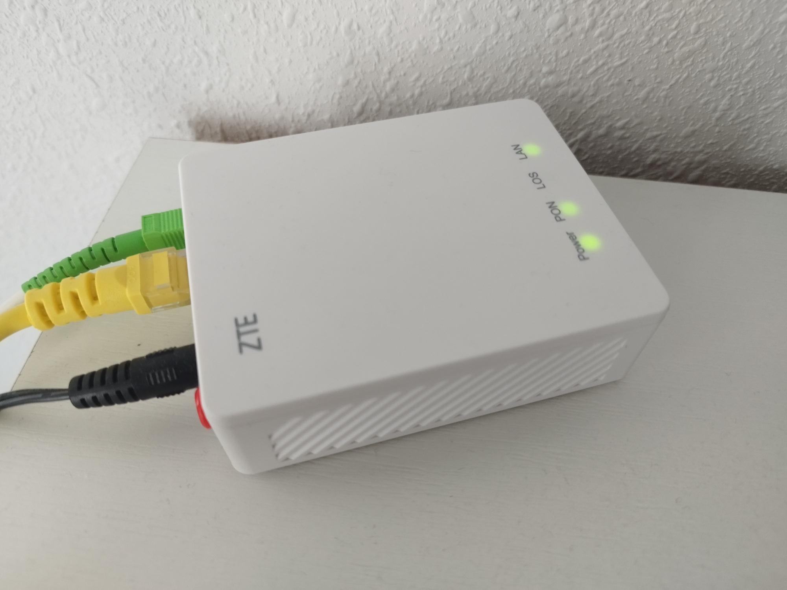
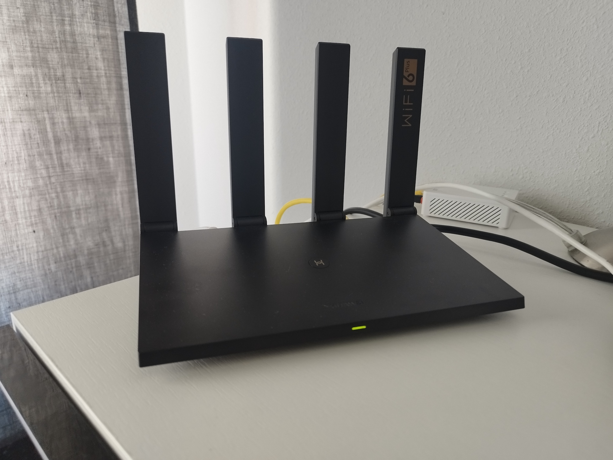
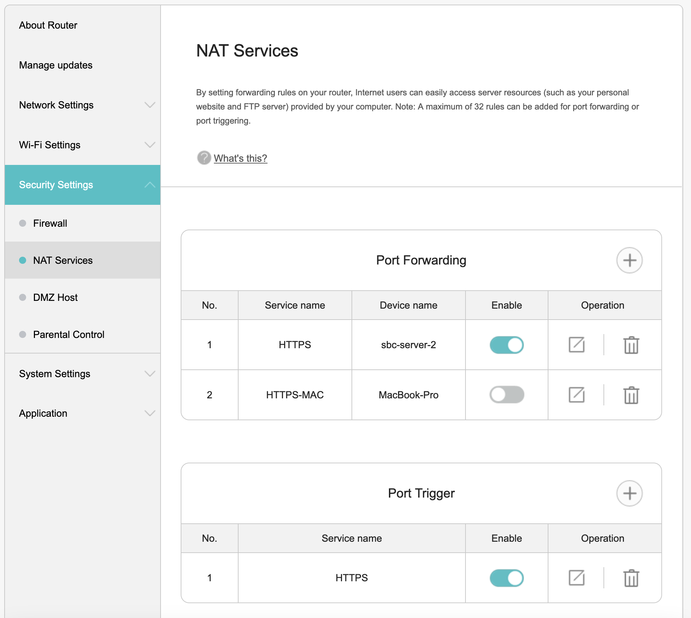
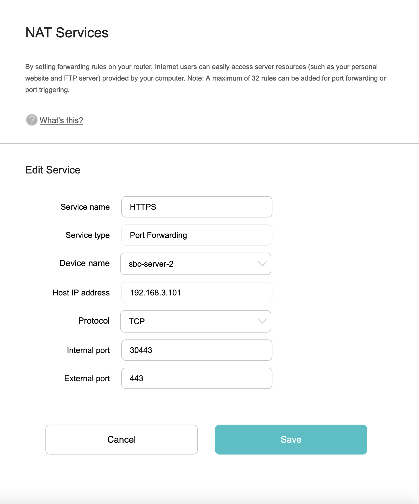

# NAT (Network address translation)

These are the devices needed.

=== " ONT Network Router 1GE"

    

    { vertical-align=top horizontal-align=center width=800 }

    Top View

    

=== "HUAWEI WiFi AX3 Pro"

    

    { vertical-align=top horizontal-align=center width=800 }

    Top View

    

## Firewall

=== "NAT Services"

    

    { vertical-align=top horizontal-align=center width=800 }

    Top View

    

=== "Port forwarding"

    

    { vertical-align=top horizontal-align=center width=800 }

    Top View

    

