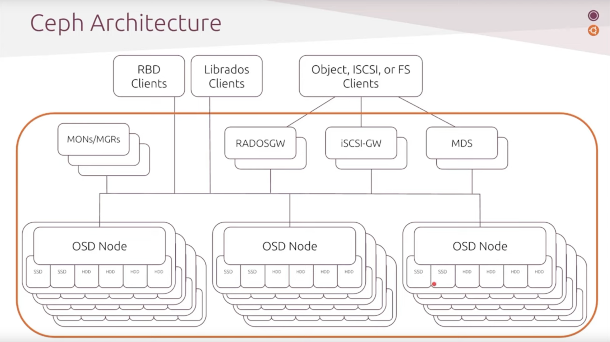
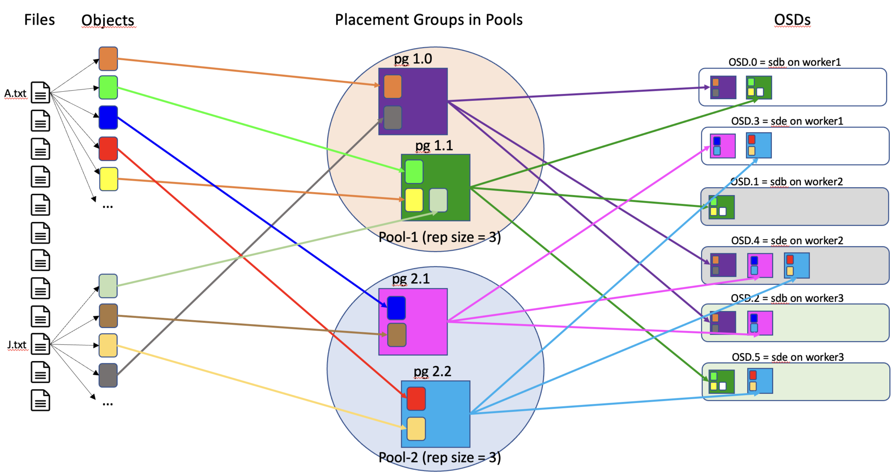
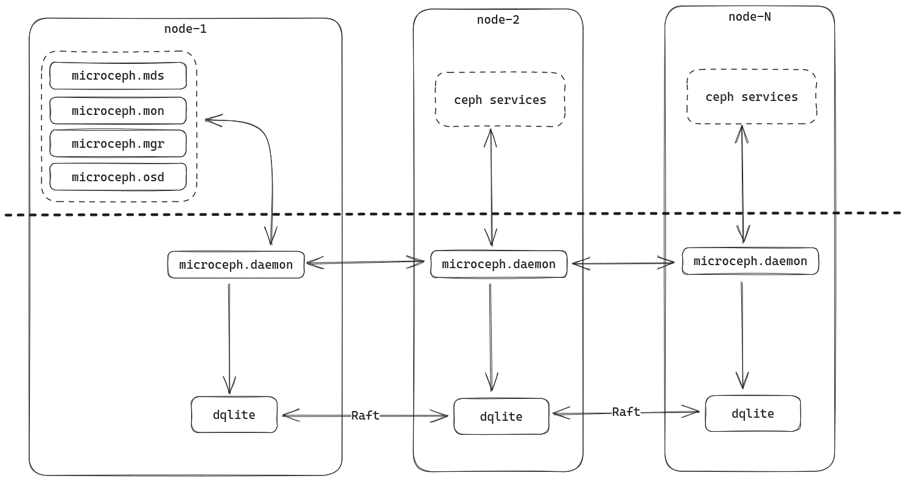
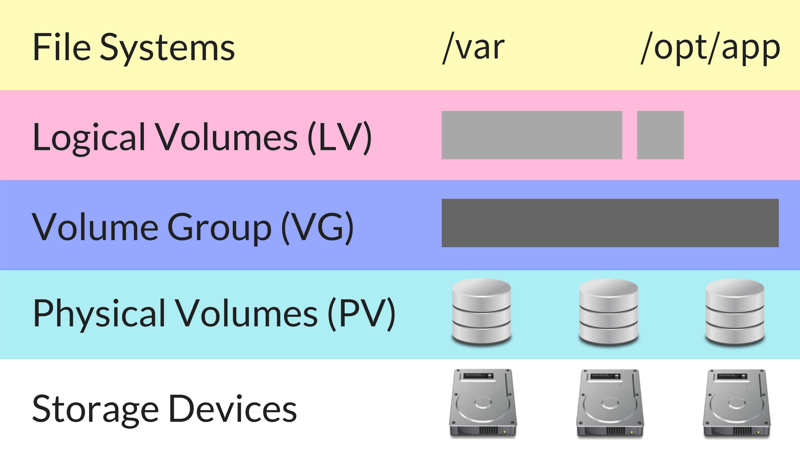

# README

## Introduction

**Hyper-converged infrastructure (HCI)** is a software-defined IT infrastructure that `virtualizes` all of the elements of conventional "hardware-defined" systems. HCI includes, at a minimum, virtualized computing (a hypervisor), software-defined storage, and virtualized networking (software-defined networking). HCI typically runs on commercial off-the-shelf (COTS) servers. The traditional silos of compute and storage resources can be wrapped up into a single hyper-converged appliance. Separate storage networks (SANs) and connections via network attached storage (NAS) disappear.

There has been discussion around having suitable storage solution for Kubernetes and this discussion has always centred on the need that storage should be run as its own service, to be consumed by deployments, rather than built as part of them using native components. Although we have a few different storage services available, but may really not be suitable for what we want to achieve:

* **Cloud Storage** - perfect for object storage, but not particularly performant and will usually require application refactoring.
* **Cloud Filestore** - expensive but reliable and performant managed NFS solution.
* **Roll-your-own in Compute** - the last resort of a desperate system admin. One can get lost for days trying to string a `GlusterFS` cluster together and then comes the headache when there's need to change it.
* **Vendor lock-in** - some organizations that prefer to run their own self-manage Kubernetes cluster on-premises may not want to be locked into any cloud vendors and still wants a high-performing, highly scalable distributed storage system with no single point of failure.

### Rook Operator

This is an **operator** and **orchestrator** for Kubernetes that automates the provisioning, configuration, scaling, migration and disaster recovery of storage. Rook supports several backend providers (such `ceph`, `cassandra`, etc.) and uses a consistent common framework across all of them. The Ceph provider for Rook is **stable** and **production** ready.

Rook consists of multiple components:

* **Rook Operator** is the core of Rook. The Rook operator is a simple container that automatically bootstraps the storage clusters and monitors the storage daemons to ensure the storage clusters are healthy.
* **Rook Agents** run on each storage node and configure a FlexVolume plugin that integrates with Kubernetes' volume controller framework. Agents handle all storage operations such as attaching network storage devices, mounting volumes on the host, and formatting the filesystem.
* **Rook Discovers** detect storage devices attached to the storage node.

Rook also deploys `MON`, `OSD` and `MGR` daemons for the Ceph clusters as Kubernetes pods.

The Rook Operator enables you to create and manage your storage clusters through CRDs. Each type of resource has its own CRD defined.

* A Rook Cluster provides the settings of the storage cluster to serve block, object stores, and shared file systems. Each cluster has multiple pools.
* A Pool manages the backing store for a block store. Pools are also used internally by object and file stores.
* An Object Store exposes storage with an S3-compatible interface.
* A File System provides shared storage for multiple Kubernetes pods.
* Rook Ceph provide `RWO` (**CephRBD**) and `RWX` (**CephFS**) volumes types. Also is support Object Storage via **RADOS** engine.

### Ceph

Ceph is an open-source project that provides massively scalable, software-defined storage systems on commodity hardware. It can provide object, block or file system storage, and automatically distributes and replicates data across multiple storage nodes to guarantee no single point of failure.

At its heart, Ceph is a distributed storage system engineered to carry out massive data management tasks, which it accomplishes through the use of the RADOS (Reliable Autonomic Distributed Object Store) system. Its architecture is designed to distribute data across various machines in a scalable fashion.



Ceph consists of multiple components:

* **Ceph Monitors (MON)** are responsible for forming cluster quorums. All the cluster nodes report to monitor nodes and share information about every change in their state.
* **Ceph Object Store Devices (OSD)** are responsible for storing objects on local file systems and providing access to them over the network. Usually, one OSD daemon is tied to one physical disk in your cluster. Ceph clients interact with OSDs directly.
* **Ceph Manager (MGR)** provides additional monitoring and interfaces to external monitoring and management systems.
* **Reliable Autonomic Distributed Object Stores (RADOS)** are at the core of Ceph storage clusters. This layer makes sure that stored data always remains consistent and performs data replication, failure detection, and recovery among others.

To read/write data from/to a Ceph cluster, a client will first contact Ceph MONs to obtain the most recent copy of their cluster map. The cluster map contains the cluster topology as well as the data storage locations. Ceph clients use the cluster map to figure out which OSD to interact with and initiate a connection with the associated OSD.

Files stored in the disk (`images`) are converted into several objects. These objects are then distributed into `placement groups` (`pg`) which are put into `pools`. A `pool` has some properties configured as how many `replicas` of a `pg` will be stored in the cluster (3 by default). Those `pg` will finally be physically stored into an `Object Storage Daemon` (OSD). An `OSD` stores `pg` (and so the objects within it) and provides access to them over the network.



There are two techniques in order to maintain the data spread for all the cluster, in order to ensure `high availability` and `disaster recovery`.

* **replication**: this allows the OSD (disks) to be replicated over some other Ceph instances within the **same** cluster. This can be replication within the same **Availability Zone** but with separation of rack, netwrking, power suppliers, etc..
* **mirroring**: this allows the OSD (disks) to be replicated over some other Ceph instances within **different** clusters. This can be different **region** for backups cluster for disaster Recove, so depending on metrics RTO or RPO decice the strategy to follow: BACKUP/Restore, Pilot Light, Warmup StandBy or Active/Passive, Active-Active.
* **Snapshot**: Since an OSD is created by mounting a device (loop, partition, lvm, disk, etc..) you can take an snapshot or backup directly. Using Kubernetes and Rook, there is a native resource from Kubernetes (`snapshot.storage.k8s.io/v1`) that allows to create backups of the persistent volumes in order to perform maintenance task of other two methods fail.

### RWO vs RWX

Both volume types are supported by Kubernetes and Container Storage Interface (**CSI**), that is implemented by Ceph Rook.

Basically `RWO` is `ReadWriteOnce`, that means only one Pod can Read or Write to that particular volume. However `RWX` is `ReadWriteMany`, that means a volume can be shared among multiple Pods.

RWO vs RWX: An important difference is that the filesystem for `RWO` is `ext4` and for `RWX` is `nfs4`. As the `RWX` is using a *network file storage* (**NFS**), there will be a lot of overhead, which is only necessary to allow for such a remote storage.

Following are some conclusions for standard benchmarks:

* RWX local vs remote, does not make a difference. Likely because the same calls are being made regardless.
* RWO local vs remote, for large and medium sized blocks there is a difference up to 30%, but no difference when the files get small.
* RWO vs RWX: Significant Difference of 50% or more in the duration! IOPS and Bandwidth are even up to 250% faster (might be too artificial, so not soo relevant). Difference of remote and local is as expected when using the data of the left plots.

## MicroCeph

MicroCeph is the easiest way to get up and running with Ceph.

MicroCeph is a lightweight way of deploying and managing a Ceph cluster. Ceph is a highly scalable, open-source distributed storage system designed to provide excellent performance, reliability, and flexibility for object, block, and file-level storage.

Ceph cluster management is streamlined by simplifying key distribution, service placement, and disk administration for quick, effortless deployment and operations. This applies to clusters that span private clouds, edge clouds, as well as home labs and single workstations.

MicroCeph is focused on providing a modern deployment and management experience to Ceph administrators and storage software developers.



The microceph snap packages all the required ceph-binaries, dqlite and a small management daemon (microcephd) which ties all of this together. Using the light-weight distributed dqlite layer, MicroCeph enables orchestration of a ceph cluster in a centralised and easy to use manner.

### Installation

```bash
# Connect to the Servers
ssh ubuntu@localhost -p 50031

 # Install MicroCeph in servers
sudo snap install microceph --channel latest/stable
sudo snap connect microceph:hardware-observe
sudo snap connect microceph:dm-crypt
sudo snap refresh --hold microceph

# Check status (same outputs)
sudo microceph.ceph status
sudo ceph status

# Configure MicroCeph and add nodes

#sudo microceph init # It Works because the IP can be changed to use different network interface
#sudo microceph cluster bootstrap # https://github.com/canonical/microceph/issues/197
#sudo microceph cluster bootstrap --mon-ip 192.168.205.101 --public-network 192.168.205.101/24 --cluster-network 192.168.205.101/24

# Master Node
SERVER_IP=192.168.205.101
SERVER_MASTER=yes
SERVER_NAME=server-1
ADD_SERVER=no
ADD_DISK=no
printf "$SERVER_IP\n$SERVER_MASTER\n$SERVER_NAME\n$ADD_SERVER\n$ADD_DISK\n" | sudo microceph init

# Check the cluster status
sudo ceph status
sudo microceph cluster list

# Add Nodes
sudo microceph cluster add server-2
sudo microceph cluster add server-3

# Join Nodes

# Node 1
SERVER_IP=192.168.205.102
SERVER_MASTER=no
SERVER_TOKEN=eyJuYW1lIjoic2VydmVyLTIiLCJzZWNyZXQiOiJjYjQ5ZDcwZmQ1MzRiZmNiOTg2Y2U3NjBlMWE4NmQwNGNmN2JiMGQ5MDhiZTdjMzEwNWY0ZmYzYTg3MmVkMjg5IiwiZmluZ2VycHJpbnQiOiI0YTcwMGRjYmFhYWZkZTJhN2YyMzFiM2MxMzU1MWRhZTg5MGM4ZTZkN2YzYjBmNzhkOGUyZjM1NzlmNWYwNmE4Iiwiam9pbl9hZGRyZXNzZXMiOlsiMTkyLjE2OC4yMDUuMTAxOjc0NDMiXX0=
ADD_DISK=no
printf "$SERVER_IP\n$SERVER_MASTER\n$SERVER_TOKEN\n$ADD_DISK\n" | sudo microceph init

# Node 2
SERVER_IP=192.168.205.103
SERVER_MASTER=no
SERVER_TOKEN=eyJuYW1lIjoic2VydmVyLTMiLCJzZWNyZXQiOiIxOTBlMWM3YjhiNzA5YzA5ZjhmZGQzYWQxMDE2NzZiZmMyMzNiYTc3Yzc2Y2E5YjQzNjM2MzExZDYzMGZmNzRkIiwiZmluZ2VycHJpbnQiOiI0YTcwMGRjYmFhYWZkZTJhN2YyMzFiM2MxMzU1MWRhZTg5MGM4ZTZkN2YzYjBmNzhkOGUyZjM1NzlmNWYwNmE4Iiwiam9pbl9hZGRyZXNzZXMiOlsiMTkyLjE2OC4yMDUuMTAxOjc0NDMiXX0=
ADD_DISK=no
printf "$SERVER_IP\n$SERVER_MASTER\n$SERVER_TOKEN\n$ADD_DISK\n" | sudo microceph init

# Check the status
sudo ceph status
sudo microceph cluster list
# The status of the cluster must be HEALTH_OK

# Enable RADOS Gateway (Object Storage)
sudo microceph enable rgw
# Create Client Key and Client Secret
sudo radosgw-admin user create --uid=myuser --display-name=myuser

# Enable Dashboard https://github.com/UtkarshBhatthere/microceph/blob/2cb0efaf57b5dd7d8328b2ff2891460b0da16125/docs/tutorial/enable_dashboard.rst
sudo ceph mgr module enable dashboard
sudo ceph dashboard create-self-signed-cert
sudo ceph mgr services
sudo microceph.ceph mgr module ls

echo "ubuntu1234" > ceph-pass.txt
sudo cp ~/ceph-pass.txt /root/  # Workaround for permissions
sudo ceph dashboard ac-user-create ubuntu -i /root/ceph-pass.txt administrator

# (ubuntu/ubuntu1234)
# http#s://192.168.205.101:8443/#/login?returnUrl=%2Fdashboard

# Enable Prometheus in Ceph
sudo ceph mgr module enable prometheus
sudo ceph config set mgr mgr/prometheus/server_addr 192.168.205.101
sudo ceph config set mgr mgr/prometheus/server_port 30436
sudo ceph mgr services

#{
#    "dashboard": "https://192.168.205.101:8443/",
#    "prometheus": "http://192.168.205.101:9283/"
#}

# Alerts
sudo ceph dashboard set-alertmanager-api-host 'http://localhost:9093'
sudo ceph dashboard set-prometheus-api-host 'http://192.168.205.101:30436' # Through ingress, load balancer or NodePort (not recommended)
sudo ceph dashboard set-prometheus-api-ssl-verify False
sudo ceph dashboard set-alertmanager-api-ssl-verify False

# Upgrade MicroCeph (https://github.com/canonical/microceph/blob/main/docs/how-to/reef-upgrade.rst)
sudo snap refresh microceph --channel reef/stable

# Uninstall MicroCeph
sudo snap remove microceph

```

Main cluster Configuration and commands

```bash
sudo microceph cluster config list
sudo microceph cluster config set cluster_network 192.168.205.0/24
sudo microceph cluster config reset cluster_network

sudo microceph cluster list
sudo microceph cluster remove server-1
sudo microceph cluster add server-2
sudo microceph cluster add server-3

echo eyJuYW1lIjoic2VydmVyLTMiLCJzZWNyZXQiOiIzMTM1Y2JmNzE0MTQ1NzYzNDdkNmY2ODllZjJiNWY1MGU5NWI0MjA0MzhhZDQxNTg4MzlmN2RlODhmZTViMTZlIiwiZmluZ2VycHJpbnQiOiI5NWM4MjhjN2E2NGNjZDYzYWM3OWNjZGFkNWVkNmFmMjQzZDFkMmUzODZjMGE2NzYyMDk3OTA2ZjM0NmY5YmU5Iiwiam9pbl9hZGRyZXNzZXMiOlsiMTkyLjE2OC4yMDUuMTAxOjc0NDMiLCIxMC4wLjIuMTU6NzQ0MyJdfQ== | base64 -d | jq .

sudo microceph cluster join  eyJuYW1lIjoic2VydmVyLTMiLCJzZWNyZXQiOiIzMTM1Y2JmNzE0MTQ1NzYzNDdkNmY2ODllZjJiNWY1MGU5NWI0MjA0MzhhZDQxNTg4MzlmN2RlODhmZTViMTZlIiwiZmluZ2VycHJpbnQiOiI5NWM4MjhjN2E2NGNjZDYzYWM3OWNjZGFkNWVkNmFmMjQzZDFkMmUzODZjMGE2NzYyMDk3OTA2ZjM0NmY5YmU5Iiwiam9pbl9hZGRyZXNzZXMiOlsiMTkyLjE2OC4yMDUuMTAxOjc0NDMiLCIxMC4wLjIuMTU6NzQ0MyJdfQ==
```

Basic Ceph configuration commands.

```bash

sudo microceph.ceph status
sudo ceph status

sudo microceph.ceph config dump
sudo microceph.ceph mon dump
sudo microceph.ceph osd dump

sudo ceph osd lspools
sudo ceph osd tree

cat /var/snap/microceph/current/conf/ceph.conf
cat /var/snap/microceph/current/conf/keyring.conf
sudo ss -tlnp | grep mon
```

Create a complex Ceph configuration, use an BD pool backed by specific OSDs (e.g. tenant separation, use only SSD disks, ...)

```bash

# Create Crush Rule
sudo ceph osd crush rule create-replicated my_replicated_ssd_rule default host ssd

# Create a new pool
sudo rbd pool create my-ssd-pool

# Set The Crash Rule to the pool
sudo ceph osd pool set my-ssd-pool crush_rule my_replicated_ssd_rule

# Finally, configure rook-ceph CRDs to use the new created `my-ssd-pool`with custom rules
```

Create RDB (Rados Data Block) Pool

```bash
# https://docs.ceph.com/en/latest/rados/operations/pools/
# Pool names beginning with . are reserved for use by Ceph's internal operations. Do not create or manipulate pools with these names.

sudo ceph osd pool create default.pool replicated
sudo ceph osd pool set default.pool size 3
sudo ceph osd pool set default.pool min_size 2
sudo ceph osd pool set default.pool pg_autoscale_mode on
sudo sudo rbd pool init default.pool


# Get list pools
sudo ceph osd pool ls
sudo ceph osd pool ls detail --format json-pretty

# Pool types
#  The replicated pools require more raw storage but can implement all Ceph operations.
#  The erasure pools require less raw storage but can perform only some Ceph tasks and may provide decreased performance.

# Replicated Block
sudo ceph osd pool create {pool-name} [{pg-num} [{pgp-num}]] [replicated] [crush-rule-name] [expected-num-objects]

# Erasure Block (Better performance for anti-corruption)
sudo ceph osd pool create {pool-name} [{pg-num} [{pgp-num}]] [erasure] \
         [erasure-code-profile] [crush-rule-name] [expected_num_objects] [--autoscale-mode=<on,off,warn>]

```

CephFS for RWX support

```bash
# https://docs.ceph.com/en/quincy/cephfs/createfs/
sudo ceph osd pool create default.cephfs.data
sudo ceph osd pool create default.cephfs.metadata
sudo ceph fs new default.cephfs default.cephfs.metadata default.cephfs.data
sudo ceph fs set default.cephfs allow_standby_replay 1

# Get application from CephFs
sudo ceph osd pool application get cephfs_data cephfs
sudo ceph osd pool application get cephfs_metadata cephfs

# erasure Pool https://docs.ceph.com/en/latest/rados/operations/erasure-code/
sudo ceph osd pool create ecpool erasure
sudo ceph osd pool set cephfs_data allow_ec_overwrites true

# Create FS volume
sudo ceph fs volume create mmy-cephfso

# Get the status from CephFS
sudo ceph fs status

# Configure Rook-Ceph

```

Add loop devices to Cepg

```bash
# Three OSDs will be required to form a minimal Ceph cluster. In a production system, typically we would assign a physical block device to an OSD.
#  This means that, on each of the three machines, one entire disk must be allocated for storage or in single installation three OSD in the same machine
# This will create a file backed OSDs.
sudo microceph disk add loop,4G,1

# Repeat the same in other cluster for redundancy and replication
sudo microceph disk list

```

The following loop creates three files under /mnt that will back respective loop devices.
Each Virtual disk is then added as an OSD to Ceph, but the need to be added at /etc/fstab in order the be recognized at startup.

```bash
# Create loop device at /mnt folder
sudo mktemp -p /mnt XXXX.img # /mnt/IICQ.img
sudo truncate -s 1G "IICQ.img" # Expand to 1Gb
sudo losetup --show -f IICQ.img # /dev/loop3
# the block-devices plug doesn't allow accessing '/dev/loopX' devices so we make those same devices available under alternate names '/dev/sdiY'
sudo mknod -m 0660 "/dev/sdia" b 7 3 # number 3 is X from /dev/loopX

# Add device to Ceph
# For each Disk Ceph will create an OSD
# In total it will create 9 OSD and 3 disk per server
sudo microceph disk add --wipe "/dev/sdi${l}"

# List Block Devices
lsblk
losetup -a  #  list loop devices
sudo microceph disk list
sudo ceph mgr services

# Detach from loop devices and remove from /dev
sudo microceph disk remove /dev/sdia
sudo microceph disk remove /dev/sdib
sudo losetup -d /dev/loop3
sudo losetup -d /dev/loop4
sudo rm -rf /dev/sdia
sudo rm -rf /dev/sdib
```

Following script creates three disks on each server of Ceph cluster

```bash
############
# Script
############
# Script to create 1Gb loop devices: /dev/sdia,/dev/sdib,/dev/sdic
for l in a b c; do
  loop_file="$(sudo mktemp -p /mnt XXXX.img)"
  sudo truncate -s 1G "${loop_file}"
  loop_dev="$(sudo losetup --show -f "${loop_file}")"
  # the block-devices plug doesn't allow accessing /dev/loopX
  # devices so we make those same devices available under alternate
  # names (/dev/sdiY)
  minor="${loop_dev##/dev/loop}"
  sudo mknod -m 0660 "/dev/sdi${l}" b 7 "${minor}"
  sudo microceph disk add --wipe "/dev/sdi${l}" # --encrypt
  # to be permanent add the device into /etc/fstab
  # /path/to/file       /path/to/mount       ext4       loop       0 0
done

# Get disks
sudo microceph disk list
sudo ceph mgr services

df
```

Test the replication

```bash
# Mount of the loop devices
sudo mount /dev/sdia /mnt/ && sudo sync

# Unmount device
sudo umount /mnt/  && sudo sync
```

### Notes

[https://discuss.linuxcontainers.org/t/microceph-vs-cephadm-microceph-partition-fix/18976]

I've been experimenting with microceph & more briefly with cephadm (with services running in podman) on a 5 x node "low end" cluster - these details are probably more interesting for people with nodes having single disks who still want to run ceph. TLDR - I'm going to be using microceph for various reasons:

* For your cluster you want at least 2 x NIC's ideally with a 10gb or greater internal network for ceph
* 5 x node clusters will have better performance 1 than 3 x node clusters.
* microceph uses around 1.5gb of RAM on monitor nodes & 500mb on the other nodes
* microceph clusters reboot much faster (less than 10 seconds on nvme) - than cephadm nodes (the services in podman took much longer to stop - 30 to 60 * seconds or so)
* cephadm uses a lot more disk (as it's running a complete Centos 8 stream system in each container) - RAM usage was similar to microceph
* cephadm will not install directly onto partitions - it requires lvm lv's
* install podman then apt install cephadm --no-install-recommends (to avoid pulling in docker) - ubuntu 23.10 gives you podman v4 from the official repos * now. You probably want to use docker with cephadm - my cephadm cluster never became healthy (mgr kept crashing - possibly due to using podman ?)
* Rather than going by the microceph docs - use microceph init to initialise every node so you can choose the specific ip address to run ceph on (otherwise * by default it will use your public interfaces)

## Rook

```bash
# https://www.mrajanna.com/setup-external-ceph-with-rook/
# https://medium.com/techlogs/configuring-rook-with-external-ceph-6b4b49626112
# https://blog.mymware.com/2022/11/02/rook-ceph-survguide.html
# https://www.youtube.com/watch?v=-7hpXFs7au8

# Connect to the Servers
ssh ubuntu@localhost -p 50031

##################################
# Automatic
##################################

sudo microceph.ceph mon dump
sudo ceph auth get-key client.admin
sudo ceph auth get-or-create client.kubernetes2
sudo ceph auth get-or-create client.csi-rbd-provisioner2

# Check the following links to import external Ceph cluster
# https://rook.io/docs/rook/latest-release/CRDs/Cluster/external-cluster/?h=external#import-the-source-data
# https://rook.io/docs/rook/latest-release/CRDs/Cluster/external-cluster/#1-create-all-users-and-keys
# https://github.com/canonical/microk8s-core-addons/blob/main/addons/rook-ceph/plugin/connect-external-ceph
# https://github.com/rook/rook/issues/11157

sudo apt install jq vim htop -y
sudo apt-get install python3-rbd python3-rados -y
wget https://raw.githubusercontent.com/rook/rook/master/deploy/examples/create-external-cluster-resources.py

sudo python3 create-external-cluster-resources.py \
  --namespace rook-ceph \
  --ceph-conf=/var/snap/microceph/current/conf/ceph.conf \
  --keyring=/var/snap/microceph/current/conf/ceph.keyring \
  --rbd-data-pool-name default.pool \
  --cephfs-filesystem-name default.cephfs \
  --cephfs-metadata-pool-name default.cephfs.meta \
  --cephfs-data-pool-name default.cephfs.data \
  --rgw-endpoint 192.168.205.101:8080 \
  --rgw-pool-prefix default \
  --format bash

# Replace following environment
export ROOK_EXTERNAL_ADMIN_SECRET=$(sudo ceph auth get-or-create-key client.admin mon 'allow *' osd 'allow *' mgr 'allow *' mds 'allow *')
export ROOK_EXTERNAL_MONITOR_SECRET=$(sudo ceph auth get-or-create-key mon. mon 'allow *')

wget https://raw.githubusercontent.com/rook/rook/master/deploy/examples/import-external-cluster.sh
chmod +x import-external-cluster.sh
./import-external-cluster.sh

# Delete previous secrets and configmap created
kubectl -n rook-ceph delete secret rook-ceph-mon
kubectl -n rook-ceph delete cm rook-ceph-mon-endpoints rook-csi-rbd-node csi-rbd-provisioner
kubectl delete storageclass ceph-rbd

##################################
# Manually
##################################

ROOK_ADMIN_KEY=$(sudo ceph auth get-or-create-key client.admin mon 'allow *' osd 'allow *' mgr 'allow *' mds 'allow *')
ROOK_MON_KEY=$(sudo ceph auth get-or-create-key mon. mon 'allow *')

export NAMESPACE=rook-ceph
export ROOK_EXTERNAL_CEPH_MON_DATA=server-1=192.168.205.101:6789,server-2=192.168.205.102:6789,server-3=192.168.205.103:6789
export ROOK_EXTERNAL_FSID=$(sudo ceph fsid)
export ROOK_EXTERNAL_CLUSTER_NAME=$NAMESPACE
export ROOK_EXTERNAL_MAX_MON_ID=0

kubectl create namespace $NAMESPACE

kubectl -n "$NAMESPACE"  create secret generic rook-ceph-mon \
 --from-literal=cluster-name="$ROOK_EXTERNAL_CLUSTER_NAME" \
 --from-literal=fsid="$ROOK_EXTERNAL_FSID" \
 --from-literal=admin-secret="$ROOK_ADMIN_KEY" \
 --from-literal=mon-secret="$ROOK_MON_KEY"

kubectl -n "$NAMESPACE" create configmap rook-ceph-mon-endpoints \
 --from-literal=data="$ROOK_EXTERNAL_CEPH_MON_DATA" \
 --from-literal=mapping="$ROOK_EXTERNAL_MAPPING" \
 --from-literal=maxMonId="$ROOK_EXTERNAL_MAX_MON_ID"


```

## LVM

**Logical Volume Manager** (LVM) plays an important role in the Linux operating system by improving the availability, disk I/O, performance and capability of disk management. LVM is a widely used technique that is extremely flexible for disk management.

This adds an extra layer between the **physical disks** and the **file system**, allowing you to create a **logical volume** instead of a physical disk.
LVM allows you to easily `resize`, `extend` and `decrease` the logical volume when you need it.



The steps to create logical volumens are the following.

* Create a Physical Volumes(PV) on the disk. (`pvcreate [Physical Volume Name]`)
* Create the Volume Group(VG) on the Physical Volumes (`vgcreate [Volume Group Name] [Physical Volume Name] [Physical Volume Name]`)
* Create Logical Volumes(LV) on the Volume Group (`lvcreate –L [Logical Volume Size] –n [Logical Volume Name] [Name of the Volume Group where the LV to be created]`)
* Create a filesystem for the logical volumes**

```bash
# Run all List Blocks devices (look for the TYPE lvm) to identify the correct disk which are to be used in the LVM
# using the fdisk command or any other disk management command [lsblk].
sudo lsblk # sudo fdisk -l

# NAME                      MAJ:MIN RM  SIZE RO TYPE MOUNTPOINTS
# loop0                       7:0    0 69.2M  1 loop /snap/core22/1125
# loop2                       7:2    0 35.2M  1 loop /snap/snapd/20674
# vda                       252:0    0   60G  0 disk
# ├─vda1                    252:1    0    1G  0 part /boot/efi
# ├─vda2                    252:2    0    2G  0 part /boot
# └─vda3                    252:3    0 56.9G  0 part
#   └─ubuntu--vg-ubuntu--lv 253:0    0 28.5G  0 lvm  /

# The pvdisplay command provides a verbose multi-line output for each physical volume. It displays physical properties (size, extents, volume group, etc.) in a fixed format.
sudo pvdisplay

# The pvscan command scans all supported LVM block devices in the system for physical volumes.
sudo pvscan

#  PV /dev/vda3   VG ubuntu-vg       lvm2 [<56.95 GiB / 28.47 GiB free]
#  Total: 1 [<56.95 GiB] / in use: 1 [<56.95 GiB] / in no VG: 0 [0   ]

#  --- Physical volume ---
#  PV Name               /dev/vda3
#  VG Name               ubuntu-vg
#  PV Size               <56.95 GiB / not usable 3.00 MiB
#  Allocatable           yes
#  PE Size               4.00 MiB
#  Total PE              14578
#  Free PE               7289
#  Allocated PE          7289
#  PV UUID               9ZIc1w-wRGn-7LbN-Xnmk-czBV-QcX9-5XGnR2

# Get the volumes groups already creted
sudo vgs

#  VG        #PV #LV #SN Attr   VSize   VFree
#  ubuntu-vg   1   1   0 wz--n- <56.95g 28.47g

# Create Logical Volume
sudo lvcreate -L 4GB -n lv1 ubuntu-vg

# List Logical Volumes
sudo lvs

# Format the logical volumen with ext4 format (sudo lsblk -f)
sudo mkfs -t ext4 /dev/ubuntu-vg/lv1

# Create filesystem for the logical volumes and mount into the mapper
# The device mapper is a framework provided by the Linux kernel for mapping physical block devices onto higher-level virtual block devices. It forms the foundation of the logical volume manager (LVM), software RAIDs and dm-crypt disk encryption, and offers additional features such as file system snapshots.
sudo mkdir -p /data/01
sudo mount /dev/mapper/ubuntu--vg-lv1 /data/01

# To mount it permanently use that UUID number and paste it inside etc/fstab path
#   https://xan.manning.io/2017/05/29/best-practice-for-mounting-an-lvm-logical-volume-with-etc-fstab.html
#  sudo apt install vim -y
sudo blkid | grep ubuntu--vg-lv1

# /dev/mapper/ubuntu--vg-ubuntu--lv: UUID="b3087c64-de0a-41f0-b77f-85b67b8d9b26" BLOCK_SIZE="4096" TYPE="ext4"
# /dev/mapper/ubuntu--vg-mylv: UUID="ca9f7725-5a84-4757-b112-158598bc7a5c" BLOCK_SIZE="4096" TYPE="ext4"
sudo vi /etc/fstab

# Add following line
/dev/mapper/ubuntu--vg-lv1 /data/01  ext4 defaults 0 2

# Finally get all the mounted locations
# https://github.com/rook/rook/blob/master/design/ceph/ceph-volume-provisioning.md
sudo df -h
sudo lsblk

sudo reboot

```

### LVM Rook-Ceph

Using Rook Ceph, the logical volume must be created and formatted. So, as if the physical disks is not empty, it would be neecesary to formtat the device.

```bash
# Create Logical Volume
sudo lvcreate -L 4GB -n lv1 ubuntu-vg

DISK="/dev/mapper/ubuntu--vg-lv1"
sudo dd if=/dev/zero of="$DISK" bs=1M count=100 oflag=direct,dsync
sudo sgdisk --zap-all $DISK


# Remove Logical Volume
sudo lvremove /dev/ubuntu-vg/lv1

# Check current device
sudo lsblk /dev/dm-1 --bytes --nodeps --pairs --paths --output SIZE,ROTA,RO,TYPE,PKNAME,NAME,KNAME,MOUNTPOINT,FSTYPE
sudo lsblk /dev/mapper/ubuntu--vg-lv1 --bytes --nodeps --pairs --paths --output SIZE,ROTA,RO,TYPE,PKNAME,NAME,KNAME,MOUNTPOINT,FSTYPE

#SIZE="4294967296" ROTA="1" RO="0" TYPE="lvm" PKNAME="" NAME="/dev/mapper/ubuntu--vg-lv1" KNAME="/dev/dm-1" MOUNTPOINT="" FSTYPE=""

```

## References

* [https://www.youtube.com/watch?v=Uvbp3mtOltw]
* [https://www.youtube.com/watch?v=98QujsS7jFI&t=1630s]
* [https://www.youtube.com/watch?v=cR-s26Zzx4Y]
